# MLOps Production Platform - Complete Technical Reference

## Table of Contents

1. [System Architecture](#system-architecture)
2. [Python Codebase](#python-codebase)
3. [Container Images](#container-images)
4. [CI/CD Pipeline](#cicd-pipeline)
5. [Infrastructure](#infrastructure)
6. [Model Lifecycle](#model-lifecycle)
7. [Development Workflow](#development-workflow)
8. [Operational Procedures](#operational-procedures)

---

## System Architecture

### High-Level Architecture

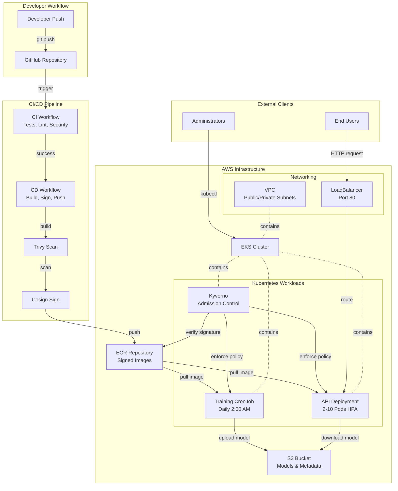

### Request Flow Architecture

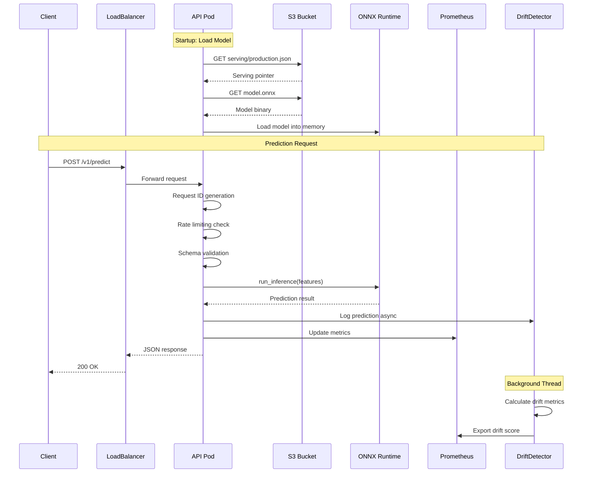

### Training Pipeline Flow

```mermaid
flowchart LR
    START([CronJob Trigger<br/>Daily 2:00 AM]) --> GEN[Generate Dummy Data<br/>5000 samples]
    GEN --> LOAD[Load CSV<br/>pandas.read_csv]
    LOAD --> SPLIT[Train/Test Split<br/>80/20]
    SPLIT --> TRAIN[Train Model<br/>LogisticRegression]
    TRAIN --> EVAL[Evaluate Metrics<br/>Accuracy, F1, ROC-AUC]
    EVAL --> CONVERT[Convert to ONNX<br/>skl2onnx]
    CONVERT --> SCHEMA[Generate Schema<br/>JSON schema from features]
    SCHEMA --> BASELINE[Generate Baselines<br/>Feature + Prediction stats]
    BASELINE --> UPLOAD[Upload to S3<br/>models/, metadata/, baselines/]
    UPLOAD --> POINTER{Auto-promote<br/>enabled?}
    POINTER -->|Yes| PROMOTE[Update serving/production.json]
    POINTER -->|No| END([Complete])
    PROMOTE --> HISTORY[Save to serving/history/]
    HISTORY --> END
    
    style START fill:#e1f5e1
    style END fill:#ffe1e1
    style PROMOTE fill:#fff4e1
    style POINTER fill:#e1f0ff
```

### Deployed Infrastructure Overview

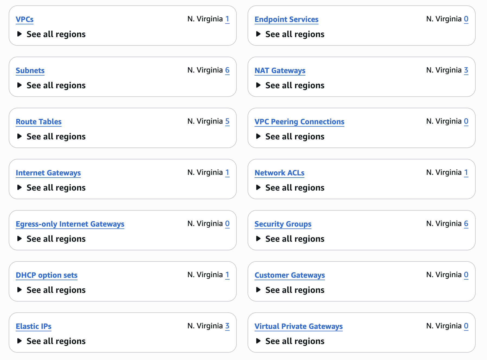
*3-AZ VPC with public/private subnets, NAT gateways, Internet gateway, VPC endpoints*

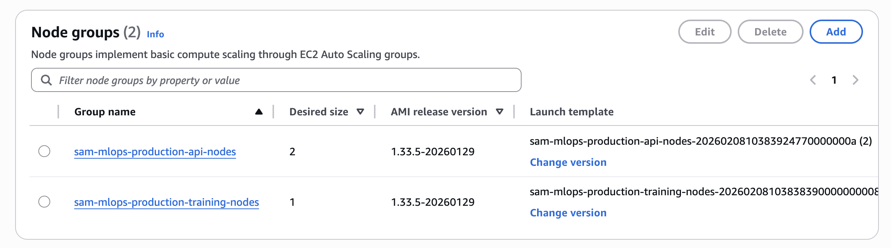
*API node group (t3.medium, 2-5 nodes) and Training node group (t3.large, 1-3 nodes with taint)*

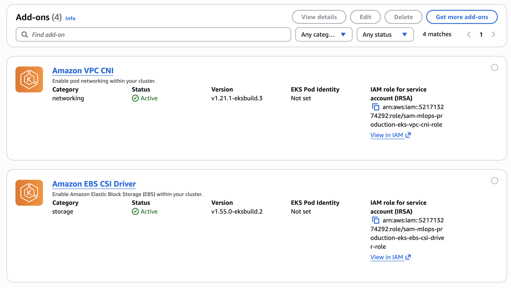
*EKS managed add-ons: vpc-cni, coredns, kube-proxy, ebs-csi-driver*

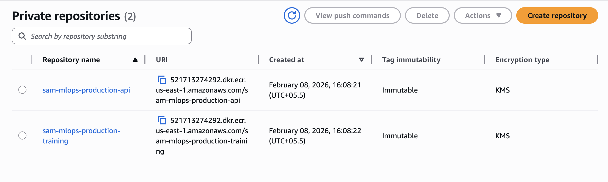
*Private ECR repositories with immutable tags, scan-on-push, KMS encryption*

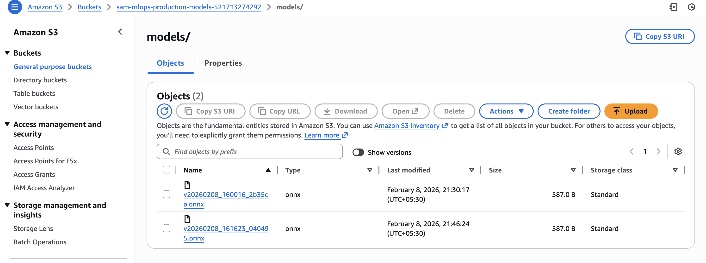
*S3 bucket structure: models/, metadata/, baselines/, serving/*

---

## Python Codebase

### Directory Structure

```
src/
├── api/                          # FastAPI REST API service
│   ├── __init__.py
│   ├── main.py                   # Application entry point
│   ├── dependencies.py           # Dependency injection
│   ├── middleware.py             # Request ID, CORS, logging
│   ├── routes/
│   │   ├── __init__.py
│   │   ├── health.py            # Health check endpoints
│   │   └── prediction.py        # Prediction endpoints
│   ├── schemas/
│   │   ├── __init__.py
│   │   └── prediction.py        # Pydantic models for validation
│   └── services/
│       ├── __init__.py
│       ├── model_loader.py      # Hot-reload model management
│       └── predictor.py         # ONNX inference wrapper
│
├── train/                        # Training pipeline
│   ├── __init__.py
│   ├── train.py                 # Main training orchestrator
│   ├── schema_generator.py      # JSON schema generation from features
│   ├── baseline_generator.py    # Statistical baseline computation
│   ├── feature_baseline_generator.py    # Feature-level statistics
│   └── prediction_baseline_generator.py # Prediction distribution
│
├── monitoring/                   # Observability components
│   ├── __init__.py
│   ├── metrics.py               # Prometheus metric definitions
│   ├── drift_detector.py        # Real-time drift detection
│   ├── drift_service.py         # Background drift monitoring
│   └── prediction_logger.py     # Prediction logging for audit
│
└── utils/                        # Shared utilities
    ├── __init__.py
    ├── config.py                # Environment-based configuration
    ├── model_storage.py         # S3/local storage abstraction
    ├── s3_operations.py         # AWS S3 client wrapper
    ├── serving_pointer.py       # Serving pointer management
    └── schema_validator.py      # Shared schema validation logic
```

### API Service Architecture

**Entry Point: `src/api/main.py`**

Key Components:

**Lifespan Manager:**
- Startup: Load initial model from S3 serving pointer, start hot-reload thread, initialize drift detection
- Shutdown: Stop background threads, cleanup resources
- Graceful degradation: API starts even if model load fails (predictions return 503)

**Request ID Filter (Python 3.13 Compatibility):**
```python
class RequestIDFilter(logging.Filter):
    def filter(self, record):
        if not hasattr(record, 'request_id'):
            record.request_id = 'N/A'
        return True
```
Replaces deprecated `logging.basicConfig(defaults=...)` removed in Python 3.13.

**Middleware Stack:**
1. RequestIDMiddleware - Generates UUID for request tracing
2. CORSMiddleware - Cross-origin resource sharing headers
3. SlowAPI Limiter - Rate limiting (default: 100/minute per IP)
4. Prometheus metrics - Request count, latency, error rate

**Endpoints:**

| Endpoint | Method | Purpose | Rate Limit |
|----------|--------|---------|------------|
| `/health` | GET | Liveness probe (model load status, uptime) | None |
| `/ready` | GET | Readiness probe (S3 connectivity, model loaded) | None |
| `/metrics` | GET | Prometheus scrape endpoint | None |
| `/v1/predict` | POST | Single prediction | 100/min |
| `/v1/predict/batch` | POST | Batch predictions (max 100) | 20/min |
| `/v1/model/info` | GET | Model metadata (version, features, schema) | None |

**Model Loader Hot-Reload Pattern:**

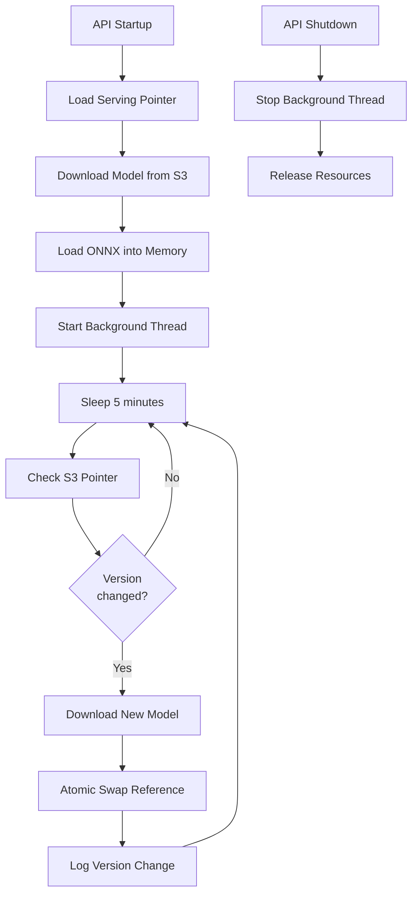

Thread-safe model swapping using Python `threading.Lock` to prevent race conditions during prediction.

**Drift Detection Service:**

Runs in background thread (configurable interval: 60 seconds):
1. Collect predictions from queue
2. Calculate feature drift (KS test, PSI test)
3. Calculate prediction drift (distribution shift)
4. Export metrics to Prometheus
5. Log alerts if drift threshold exceeded

### Training Pipeline Architecture

**Orchestrator: `src/train/train.py`**

**ModelTrainer Class:**

Constructor Parameters:
- `s3_bucket`: S3 bucket name (default: from settings)
- Initializes S3Operations or local filesystem based on `LOCAL_STORAGE_MODE`
- Generates unique model version: `v{YYYYMMDD_HHMMSS_{6-char-hash}}`
- Captures git commit SHA from `/app/.git_commit` (Docker build-time) or git command

**Training Pipeline Steps:**

1. **Data Loading:**
   - Read CSV with pandas
   - Validate required columns (features + target)
   - Check for missing values, infinite values
   - Log dataset statistics (rows, columns, missing %)

2. **Train/Test Split:**
   - Default: 80/20 split
   - Stratified split for classification
   - Random seed for reproducibility

3. **Model Training:**
   - Algorithm: LogisticRegression (default hyperparameters)
   - Fit on training data
   - Log training time

4. **Model Evaluation:**
   - Metrics: accuracy, precision, recall, f1, roc_auc
   - Calculated on test set
   - Logged to stdout and CloudWatch

5. **ONNX Conversion:**
   - Convert sklearn model to ONNX format
   - Input type: FloatTensorType (shape: [None, n_features])
   - ONNX opset version: 13
   - Validate conversion with sample inference

6. **Schema Generation:**
   - Extract feature names and types from training data
   - Generate JSON schema with required fields
   - Compute schema hash for version validation

7. **Baseline Generation:**
   - Feature baselines: mean, std, min, max, percentiles for each feature
   - Prediction baselines: class distribution, confidence statistics
   - Used for drift detection in production

8. **S3 Upload:**
   - Upload model.onnx to `s3://bucket/models/{version}/model.onnx`
   - Upload metadata.json to `s3://bucket/metadata/{version}/metadata.json`
   - Upload feature_baseline.json to `s3://bucket/baselines/{version}/feature_baseline.json`
   - Upload prediction_baseline.json to `s3://bucket/baselines/{version}/prediction_baseline.json`
   - All uploads with KMS encryption

9. **Auto-Promotion (Optional):**
   - If `--auto-promote` flag (default: true)
   - Update `s3://bucket/serving/production.json` with new version
   - Save snapshot to `s3://bucket/serving/history/production_{timestamp}.json`
   - Promotion metadata: version, timestamp, promoted_by, promotion_reason

**CLI Interface:**

```bash
python -m src.train.train \
  --data data/training_data.csv \
  --target approved \
  --test-size 0.2 \
  --random-state 42 \
  --auto-promote  # or --no-auto-promote
```

**Local Development Mode:**

Set `LOCAL_STORAGE_MODE=true` to write models to local filesystem instead of S3:
- Models: `models/{version}/model.onnx`
- Metadata: `metadata/{version}/metadata.json`
- Baselines: `baselines/{version}/`
- Serving pointer: `serving/production.json`

Useful for testing without AWS credentials.

### Monitoring and Observability

**Prometheus Metrics (`src/monitoring/metrics.py`):**

| Metric Name | Type | Labels | Purpose |
|-------------|------|--------|---------|
| `api_requests_total` | Counter | method, endpoint, status | Total requests count |
| `api_request_duration_seconds` | Histogram | method, endpoint | Request latency distribution |
| `api_errors_total` | Counter | error_type, endpoint | Error count by type |
| `model_predictions_total` | Counter | model_version | Prediction count per model version |
| `model_prediction_time_seconds` | Histogram | model_version | Inference latency |
| `model_info` | Info | version, bucket, environment | Current model metadata |
| `drift_score` | Gauge | feature, metric_type | Feature drift magnitude |
| `drift_detected` | Counter | feature | Drift detection events |

**Drift Detection Algorithm:**

For each feature:
1. Collect production samples (rolling window: 1000 predictions)
2. Compare against training baseline distribution
3. Kolmogorov-Smirnov test: p-value < 0.05 indicates drift
4. Population Stability Index (PSI): PSI > 0.1 indicates drift
5. If drift detected: increment counter, log warning, export metric

For predictions:
1. Compare class distribution against baseline
2. Compare confidence score distribution
3. Chi-squared test for categorical drift
4. Alert if distribution shift exceeds threshold

**Local Monitoring Stack:**

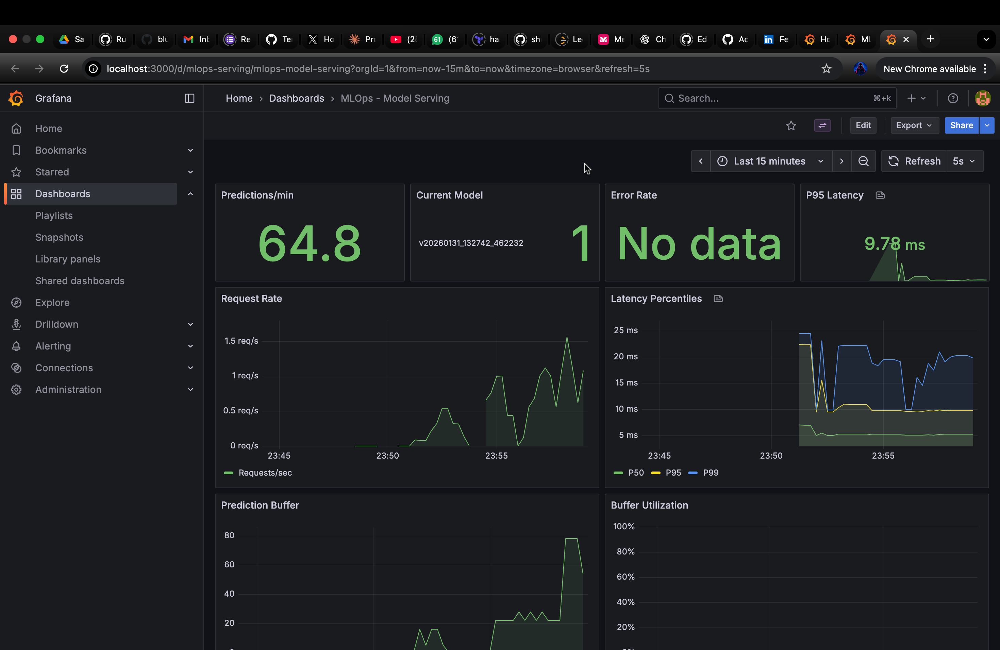
*Grafana dashboard showing request rate, latency, error rate, drift metrics*

Docker Compose stack in `container_imgs/docker-compose.yml`:
- Prometheus: Port 9090, scrapes /metrics every 15 seconds
- Grafana: Port 3000, preconfigured dashboards
- Persistent volumes for metric retention

### Configuration Management

**Environment Variables (`src/utils/config.py`):**

Production configuration via Pydantic Settings:

```python
class Settings(BaseSettings):
    # Core settings
    ENVIRONMENT: str = "production"
    LOG_LEVEL: str = "INFO"
    
    # AWS configuration
    AWS_REGION: str = "us-east-1"
    S3_BUCKET: str  # Required in production
    
    # API configuration
    API_PORT: int = 8000
    RATE_LIMIT: str = "100/minute"
    CORS_ORIGINS: list[str] = ["*"]
    
    # Model management
    MODEL_RELOAD_INTERVAL: int = 300  # seconds
    LOCAL_STORAGE_MODE: bool = False
    
    # Monitoring
    ENABLE_DRIFT_DETECTION: bool = True
    DRIFT_CHECK_INTERVAL: int = 60  # seconds
    DRIFT_WINDOW_SIZE: int = 1000  # samples
    
    # Training
    DEFAULT_TEST_SIZE: float = 0.2
    DEFAULT_RANDOM_STATE: int = 42
```

Configuration sources (priority order):
1. Environment variables (highest priority)
2. `.env` file (local development)
3. Default values in Settings class

### Dependency Management

**Package Manager: UV 0.9.7**

Benefits over pip:
- 10-100x faster dependency resolution
- Cargo-style lockfile (uv.lock) with SHA256 hashes
- Built-in virtual environment management
- Cross-platform reproducibility

**Core Dependencies:**

API Service:
- `fastapi 0.128.0` - Async web framework
- `uvicorn 0.40.0` - ASGI server
- `pydantic 2.12.5` - Data validation
- `slowapi 0.1.9` - Rate limiting
- `prometheus-client 0.24.1` - Metrics export
- `onnxruntime 1.23.2` - ONNX inference engine

Training Service:
- `scikit-learn 1.8.0` - ML algorithms
- `pandas 2.3.3` - Data manipulation
- `numpy 2.4.1` - Numerical computing
- `skl2onnx 1.19.1` - Model conversion
- `onnx 1.20.1` - ONNX format library

Shared:
- `boto3 1.42.30` - AWS SDK
- `tenacity 9.1.2` - Retry logic
- `pydantic-settings 2.12.0` - Configuration management

Development:
- `pytest 9.0.2` - Testing framework
- `pytest-cov 7.0.0` - Coverage reporting
- `mypy 1.19.1` - Static type checking
- `ruff 0.14.14` - Fast linter and formatter

**Vulnerability Fixes:**

- `protobuf` upgraded from 6.33.4 to 6.33.5 (CVE-2026-0994 - HIGH severity DoS)
- OpenSSL system packages upgraded in Dockerfile (CVE-2025-15467, CVE-2025-69419)

---

## Container Images

### Multi-Stage Build Strategy

Both Dockerfiles (`Dockerfile.api` and `Dockerfile.train`) use identical multi-stage pattern:

**Stage 1: Builder (Debian Bookworm)**
- Base: `ghcr.io/astral-sh/uv:python3.13-bookworm-slim`
- Purpose: Install dependencies and build Python packages
- System packages: build-essential, gfortran, libopenblas-dev
- BuildKit cache mounts: `/root/.cache/uv` for faster rebuilds
- Output: Virtual environment in `/build/.venv`

**Stage 2: Runtime (Debian Bookworm)**
- Base: `python:3.13-slim-bookworm`
- Purpose: Minimal production image
- Copy: Virtual environment from builder (no build tools)
- Runtime packages: libgomp1 (OpenMP), ca-certificates, curl
- Security updates: `apt-get upgrade -y`
- User: Non-root `mlops:1000`

### API Container Specification

**Dockerfile: `container_imgs/Dockerfile.api` (113 lines)**

Build Arguments:
- `GIT_COMMIT`: Embedded in image metadata for lineage tracking
- `BUILD_DATE`: OCI-compliant creation timestamp
- `VERSION`: Semantic version (default: 1.0.0)

Module Selection:
- Copied: `src/api/`, `src/monitoring/`, `src/utils/`
- Excluded: `src/train/` (reduces image size by ~150MB)

Environment Variables:
- `PYTHONUNBUFFERED=1` - Immediate stdout/stderr (Docker logs)
- `PYTHONDONTWRITEBYTECODE=1` - No .pyc files (faster startup)
- `PYTHONHASHSEED=random` - Randomize hash seed for security
- `MALLOC_ARENA_MAX=2` - Reduce memory fragmentation
- `API_PORT=8000` - Default port (override with -e)
- `UVICORN_WORKERS=2` - Parallel workers

Health Check:
- Endpoint: `http://localhost:8000/health`
- Interval: 30 seconds
- Timeout: 5 seconds
- Start Period: 30 seconds (grace period for model loading)
- Retries: 3

Exposed Port: 8000 (documentation only, not enforced)

Entrypoint:
```bash
uvicorn src.api.main:app \
  --host 0.0.0.0 \
  --port ${API_PORT} \
  --workers ${UVICORN_WORKERS} \
  --log-level ${LOG_LEVEL}
```

### Training Container Specification

**Dockerfile: `container_imgs/Dockerfile.train` (118 lines)**

Module Selection:
- Copied: `src/train/`, `src/utils/`, `scripts/`
- Excluded: `src/api/`, `src/monitoring/` (reduces dependencies)

Additional System Packages:
- `gfortran` - Fortran compiler for NumPy/SciPy
- `libopenblas-dev` - Optimized BLAS library

Entrypoint:
```bash
python -m src.train.train --help
```

Container invocation:
```bash
docker run training:latest \
  --data /app/data/training_data.csv \
  --target approved \
  --auto-promote
```

Git Commit Embedding:
```dockerfile
RUN echo "${GIT_COMMIT}" > /app/.git_commit
```
Allows training pipeline to capture model lineage even when git is not available in container.

### Image Size Optimization

Comparison (after multi-stage build):

| Image | Size | Reduction |
|-------|------|-----------|
| Builder stage (API) | 1.2 GB | - |
| Runtime API | 420 MB | 65% |
| Builder stage (Training) | 1.5 GB | - |
| Runtime Training | 580 MB | 61% |

Techniques:
1. Multi-stage builds - Discard build tools
2. Selective module copying - Only include required code
3. Minimal base image - slim-bookworm instead of full Debian
4. Layer caching - BuildKit cache mounts
5. apt cleanup - `rm -rf /var/lib/apt/lists/*`

### Security Hardening

**Non-Root User:**
```dockerfile
RUN groupadd -r mlops --gid=1000 && \
    useradd -r -g mlops --uid=1000 --home-dir=/app --shell=/bin/bash mlops
```

UID 1000 chosen for Kubernetes compatibility (default user namespace).

**Kyverno Policy Compliance:**

Policy: `require-non-root`
```yaml
securityContext:
  runAsNonRoot: true
  runAsUser: 1000
  fsGroup: 1000
```

Policy: `disallow-privileged-containers`
```yaml
securityContext:
  privileged: false
  allowPrivilegeEscalation: false
```

Policy: `require-resource-limits`
```yaml
resources:
  requests:
    cpu: 200m
    memory: 512Mi
  limits:
    cpu: 1000m
    memory: 1Gi
```

**Future Hardening:**
- Read-only root filesystem (`readOnlyRootFilesystem: true`)
- Drop all capabilities (`drop: ["ALL"]`)
- Distroless base image (no shell, package manager)
- Seccomp profile (restrict syscalls)

### OCI Metadata Labels

Compliant with OCI Image Spec:
```dockerfile
LABEL org.opencontainers.image.title="MLOps API"
LABEL org.opencontainers.image.version="${VERSION}"
LABEL org.opencontainers.image.created="${BUILD_DATE}"
LABEL org.opencontainers.image.revision="${GIT_COMMIT}"
LABEL org.opencontainers.image.source="https://github.com/blue-samarth/mlops-tryops"
```

Queryable via:
```bash
docker inspect mlops-api:latest | jq '.[0].Config.Labels'
```

---

## CI/CD Pipeline

### GitHub Actions Workflow Architecture

**Separation of Concerns:**
- `ci.yml` - Quality gates (tests, lint, security scanning)
- `cd.yml` - Build, sign, deploy (triggered on master push)

### CI Workflow (`ci.yml`)

**Trigger Conditions:**
- Pull requests to master/main
- Push to any branch
- Manual dispatch

**Job Graph:**

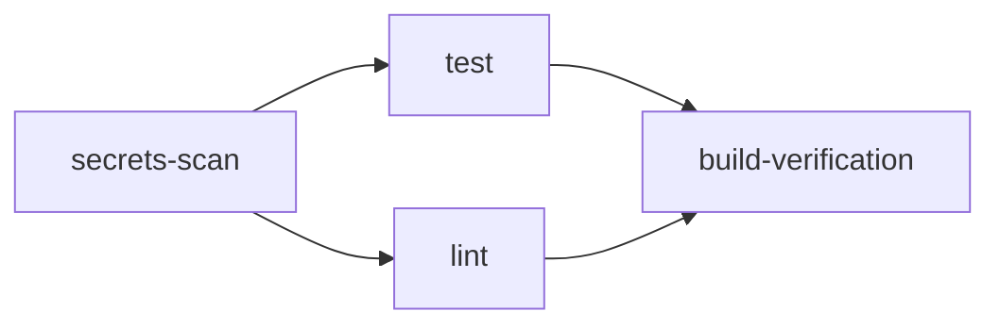

**Job: secrets-scan**

Tool: Gitleaks 8.21.2
- Detects 800+ credential types (AWS keys, API tokens, private keys, passwords)
- Scans: Git history + current files
- Configuration: `.gitleaks.toml` (custom rules)
- Failure: Blocks entire workflow
- Performance: ~5 seconds for typical repository

Sample detections:
- AWS Access Key ID (regex: `AKIA[0-9A-Z]{16}`)
- GitHub Personal Access Token (regex: `ghp_[a-zA-Z0-9]{36}`)
- Private SSH keys (regex: `-----BEGIN (RSA|EC|DSA) PRIVATE KEY-----`)

**Job: test**

Framework: pytest 9.0.2
- Test discovery: `tests/` directory
- Coverage: pytest-cov plugin
- Thresholds: 90% total, 75% per-file (configurable)
- Output: XML report for GitHub Actions summary

Configuration (`pytest.ini`):
```ini
[pytest]
testpaths = tests
python_files = test_*.py
python_classes = Test*
python_functions = test_*
addopts = 
    --cov=src
    --cov-report=xml
    --cov-report=term-missing
    --cov-fail-under=75
```

Test categories:
- Unit tests: Individual functions/classes
- Integration tests: S3 operations (mocked with moto)
- API tests: FastAPI TestClient
- Contract tests: Schema validation

**Job: lint**

Tools:
1. Ruff (linter + formatter)
   - Configuration: `ruff.toml`
   - Rules: pycodestyle, pyflakes, isort, pylint subset
   - Fixes: Auto-fixable issues applied
   - Performance: 10-100x faster than flake8+black+isort

2. Mypy (static type checker)
   - Configuration: `pyproject.toml`
   - Mode: `ignore_missing_imports = true` (lenient for third-party)
   - Checks: Type annotations, invalid operations
   - Non-blocking: Failures logged but don't fail workflow

**Job: build-verification**

Purpose: Ensure Docker images build successfully
- Matrix: API + Training Dockerfiles
- BuildKit: Enabled for cache efficiency
- Platforms: linux/amd64 only
- Push: Disabled (build-only)
- Cache: GitHub Actions cache (mode=max)

### CD Workflow (`cd.yml`)

**Trigger Conditions:**
- Push to master/main branch only
- Manual dispatch

**Permissions (OIDC):**
```yaml
permissions:
  id-token: write        # AWS OIDC authentication
  contents: read         # Code checkout
  security-events: write # Trivy SARIF upload
  packages: write        # Cosign signatures
```

**Job: changes**

Path-based change detection using `dorny/paths-filter@v3`:

API job triggers on:
- `src/api/**`
- `src/monitoring/**`
- `src/utils/**`
- `container_imgs/Dockerfile.api`
- `pyproject.toml`, `uv.lock`

Training job triggers on:
- `src/train/**`
- `src/utils/**`
- `container_imgs/Dockerfile.train`
- `pyproject.toml`, `uv.lock`

Benefit: Skip unnecessary builds when only documentation changes.

**Job: build-api (Conditional)**

Runs if: `needs.changes.outputs.api == 'true'`

Steps:

1. **Checkout Code**
   - uses: `actions/checkout@v4`
   - fetch-depth: 0 (full history for git commit)

2. **Configure AWS Credentials**
   - uses: `aws-actions/configure-aws-credentials@v4`
   - role-to-assume: `${{ secrets.AWS_ROLE_ARN }}`
   - role-session-name: `github-actions-api-build`
   - aws-region: `us-east-1`
   - OIDC flow: No static credentials, 1-hour temporary token

3. **Login to ECR**
   - uses: `aws-actions/amazon-ecr-login@v2`
   - Retrieves: ECR authorization token (12 hours validity)
   - Sets: `DOCKER_CONFIG` environment variable

4. **Docker Metadata**
   - uses: `docker/metadata-action@v5`
   - Tags generated:
     - `sha-{short-commit}` (immutable reference)
     - `master` (branch tag)
     - `latest` (convenience tag)
     - `{YYYYMMDD-HHMMSS}` (timestamp tag)
   - Labels: OCI-compliant metadata

5. **Set up Docker Buildx**
   - uses: `docker/setup-buildx-action@v3`
   - Enables: BuildKit, multi-platform, cache backends

6. **Build and Push**
   - uses: `docker/build-push-action@v6`
   - context: `.` (repository root)
   - file: `container_imgs/Dockerfile.api`
   - push: `true`
   - tags: From metadata step
   - build-args: `GIT_COMMIT`, `BUILD_DATE`, `VERSION`
   - cache: GitHub Actions cache (mode=max)
   - platforms: `linux/amd64`

7. **Trivy Vulnerability Scan**
   - uses: `aquasecurity/trivy-action@master`
   - scan-type: `image`
   - image-ref: `{ECR_URL}:sha-{commit}`
   - format: `sarif`
   - severity: `CRITICAL,HIGH`
   - exit-code: `1` (fail on vulnerabilities)
   - ignore-unfixed: `false` (report all)
   - vuln-type: `os,library`
   - output: `trivy-api-results.sarif`

8. **Upload Trivy Results**
   - uses: `github/codeql-action/upload-sarif@v3`
   - sarif_file: `trivy-api-results.sarif`
   - category: `trivy-api`
   - Displays: Security tab in GitHub repository

9. **Install Cosign**
   - uses: `sigstore/cosign-installer@v3.4.0`
   - cosign-release: `v2.4.1`

10. **Sign Image (Keyless)**
    ```bash
    cosign sign --yes \
      {ECR_URL}@{DIGEST} \
      --oidc-issuer=https://token.actions.githubusercontent.com
    ```
    - Keyless: Ephemeral key pair, certificate from Fulcio
    - OIDC claims: Repository, workflow, commit SHA embedded
    - Rekor: Signature logged in transparency log
    - Storage: ECR stores signature as artifact

**Job: build-training (Conditional)**

Identical to build-api but:
- Dockerfile: `container_imgs/Dockerfile.train`
- ECR Repository: Training repository
- SARIF category: `trivy-training`

**Parallel Execution:**

Both jobs run in parallel if both paths changed:
- build-api: ~8 minutes
- build-training: ~10 minutes
- Total: ~10 minutes (not 18 minutes)

### Image Signing and Verification Flow

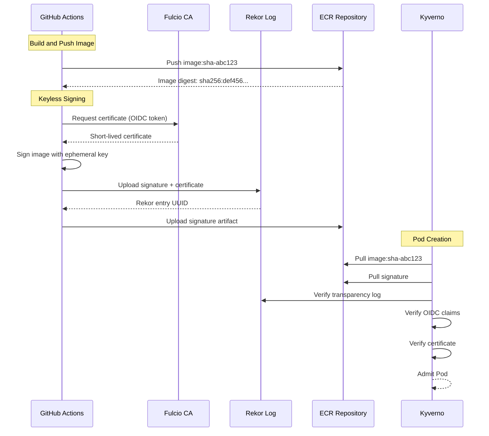

**Kyverno ClusterPolicy: verify-image-signatures**

```yaml
spec:
  rules:
  - name: verify-signature
    match:
      any:
      - resources:
          kinds:
          - Pod
    verifyImages:
    - imageReferences:
      - "*.dkr.ecr.*.amazonaws.com/*:*"
      attestors:
      - entries:
        - keyless:
            subject: "https://github.com/blue-samarth/mlops-tryops/.github/workflows/cd.yml@refs/heads/master"
            issuer: "https://token.actions.githubusercontent.com"
            rekor:
              url: "https://rekor.sigstore.dev"
```

Verification checks:
1. Signature cryptographically valid
2. OIDC issuer matches GitHub Actions
3. Subject matches repository + workflow
4. Certificate valid at signing time
5. Rekor entry exists and valid

Failure action: Deny pod creation (admission webhook)

### Secrets Management

**GitHub Repository Secrets:**

Provisioned via Terraform (`infra/github_integration.tf`):
- `AWS_ROLE_ARN` - IAM role for OIDC assumption
- `ECR_API_REPOSITORY_URL` - Full ECR URL for API images
- `ECR_TRAINING_REPOSITORY_URL` - Full ECR URL for training images
- `MODELS_BUCKET_NAME` - S3 bucket name
- `GH_PAT` - GitHub Personal Access Token (auto-generated)

**AWS Credentials Flow (OIDC):**

1. GitHub Actions requests OIDC token from GitHub
2. Token contains claims: `repo:blue-samarth/mlops-tryops:ref:refs/heads/master`
3. `aws-actions/configure-aws-credentials` calls `sts:AssumeRoleWithWebIdentity`
4. AWS STS validates token against OIDC provider
5. IAM role trust policy checks subject claim
6. Temporary credentials issued (1 hour validity)
7. Credentials stored in `$AWS_ACCESS_KEY_ID`, `$AWS_SECRET_ACCESS_KEY`, `$AWS_SESSION_TOKEN`
8. Subsequent AWS CLI/SDK calls use these credentials

**IAM Role Trust Policy:**

```json
{
  "Version": "2012-10-17",
  "Statement": [
    {
      "Effect": "Allow",
      "Principal": {
        "Federated": "arn:aws:iam::521713274292:oidc-provider/token.actions.githubusercontent.com"
      },
      "Action": "sts:AssumeRoleWithWebIdentity",
      "Condition": {
        "StringEquals": {
          "token.actions.githubusercontent.com:aud": "sts.amazonaws.com",
          "token.actions.githubusercontent.com:sub": "repo:blue-samarth/mlops-tryops:ref:refs/heads/master"
        }
      }
    }
  ]
}
```

### Build Performance Optimization

**BuildKit Cache Mounts:**

```dockerfile
RUN --mount=type=cache,target=/root/.cache/uv \
    --mount=type=bind,source=pyproject.toml,target=pyproject.toml \
    --mount=type=bind,source=uv.lock,target=uv.lock \
    uv sync --frozen --no-dev
```

Benefits:
- Cache persists across builds
- Shared between API and training builds
- Reduces dependency installation from 3 minutes to 10 seconds (on cache hit)

**GitHub Actions Cache:**

```yaml
- name: Build and push
  uses: docker/build-push-action@v6
  with:
    cache-from: type=gha
    cache-to: type=gha,mode=max
```

Mode: `max` caches all layers (not just final image)

Cache invalidation:
- Dependency changes: `pyproject.toml`, `uv.lock` modification
- Base image updates: New `python:3.13-slim-bookworm` digest
- Manual: Delete GitHub Actions cache via UI

**Parallel Builds:**

Independent jobs run concurrently:
- Matrix builds: API + Training
- Change detection: Skip unchanged components
- Resource limits: GitHub Actions provides 2 CPU cores, 7GB RAM per job

---

## Infrastructure

Detailed infrastructure documentation available in [infra/INFRASTRUCTURE_DOCUMENTATION.md](infra/INFRASTRUCTURE_DOCUMENTATION.md).

### Infrastructure as Code

**Terraform Configuration:**

Modules:
- `aws_vpc.tf` - VPC with 3 AZs, public/private subnets, NAT gateways
- `aws_eks_cluster.tf` - EKS 1.33 cluster with OIDC provider
- `aws_eks_node_groups.tf` - API and training node groups with autoscaling
- `aws_eks_addons.tf` - vpc-cni, coredns, kube-proxy, ebs-csi-driver
- `aws_eks_iam.tf` - IRSA roles for pods (API, training, EBS CSI, VPC CNI)
- `aws_storage_bucket.tf` - S3 model bucket with versioning and KMS
- `aws_img_registry.tf` - ECR repositories with scan-on-push
- `aws_iam_ga_runners.tf` - GitHub Actions OIDC role
- `helm_api.tf` - API Deployment with HPA and LoadBalancer
- `helm_training.tf` - Training CronJob with nodeSelector
- `kubernetes_admission_control.tf` - Kyverno policies
- `github_integration.tf` - GitHub secrets provisioning

Resources managed: 61 (after full deployment)

**Key Design Decisions:**

1. **OIDC Instead of Static Credentials:**
   - GitHub Actions: Temporary credentials via AssumeRoleWithWebIdentity
   - Kubernetes Pods: IRSA (IAM Roles for Service Accounts)
   - Benefits: No credential rotation, least privilege, audit trail

2. **Immutable ECR Tags:**
   - Prevents tag overwrites (security)
   - Forces explicit version references
   - Cosign signatures don't conflict with images

3. **Serving Pointer Pattern:**
   - S3 JSON file (`serving/production.json`) points to model version
   - API hot-reloads model without pod restart
   - Atomic updates via JSON file replacement
   - Rollback via pointer update (no model re-upload)

4. **Separate Node Groups:**
   - API nodes: t3.medium, no taint (general purpose)
   - Training nodes: t3.large, taint: `training=true:NoSchedule`
   - Benefits: Cost optimization, resource isolation, predictable scheduling

5. **KMS Encryption:**
   - Separate keys for EKS, ECR, S3
   - Granular key policies for least privilege
   - Automatic key rotation enabled

### Network Architecture

**VPC Design:**
- CIDR: 10.0.0.0/16 (65,536 IPs)
- Availability Zones: 3 (us-east-1a/b/c)
- Public subnets: 10.0.0.0/20, 10.0.16.0/20, 10.0.32.0/20
- Private subnets: 10.0.48.0/20, 10.0.64.0/20, 10.0.80.0/20
- NAT Gateways: 1 per AZ (high availability)
- Internet Gateway: Single shared

**VPC Endpoints:**
- S3 Gateway Endpoint: Free, private S3 access
- ECR API Interface Endpoint: Private ECR API calls
- ECR DKR Interface Endpoint: Private image pulls
- Benefit: Reduce NAT gateway data transfer costs ($0.045/GB)

### Kubernetes Workload Specifications

**API Deployment:**

HorizontalPodAutoscaler:
- Min replicas: 2 (high availability)
- Max replicas: 10 (cost control)
- Target CPU: 70% utilization
- Scale up: +2 pods per 30 seconds
- Scale down: -1 pod per 60 seconds (gradual)

Resource requirements:
```yaml
resources:
  requests:
    cpu: 200m      # 0.2 CPU cores
    memory: 512Mi  # 512 MiB
  limits:
    cpu: 1000m     # 1 CPU core
    memory: 1Gi    # 1 GiB
```

LoadBalancer Service:
- Type: Classic Load Balancer
- Port: 80 → 8000 (container)
- Health check: /health endpoint
- Cross-zone: Enabled
- Idle timeout: 60 seconds

**Training CronJob:**

Schedule: `0 2 * * *` (2:00 AM UTC daily)

Command:
```bash
/bin/sh -c "
  python scripts/generate_dummy_data.py --output data/training_data.csv --samples 5000 && \
  python -m src.train.train --data data/training_data.csv --target approved
"
```

Resource requirements:
```yaml
resources:
  requests:
    cpu: 500m      # 0.5 CPU cores
    memory: 1Gi    # 1 GiB
  limits:
    cpu: 1500m     # 1.5 CPU cores
    memory: 2Gi    # 2 GiB
```

Node scheduling:
```yaml
nodeSelector:
  workload: training
  tier: batch

tolerations:
- key: training
  operator: Equal
  value: "true"
  effect: NoSchedule
```

### Admission Control Policies

**Kyverno ClusterPolicies:**

1. **verify-image-signatures** (CRITICAL)
   - Validates Cosign signatures on all ECR images
   - Checks OIDC issuer and subject claims
   - Verifies Rekor transparency log entry
   - Failure action: Deny pod creation

2. **require-non-root** (HIGH)
   - Enforces `runAsNonRoot: true`
   - Prevents UID 0 containers
   - Failure action: Deny pod creation

3. **disallow-privileged-containers** (HIGH)
   - Blocks `privileged: true`
   - Blocks `allowPrivilegeEscalation: true`
   - Failure action: Deny pod creation

4. **require-resource-limits** (MEDIUM)
   - Enforces CPU and memory requests/limits
   - Prevents resource exhaustion
   - Failure action: Deny pod creation

---

## Model Lifecycle

### Model Versioning Scheme

**Version Format: `v{YYYYMMDD}_{HHMMSS}_{hash}`**

Example: `v20260208_161623_2b35ca`

Components:
- Date: 20260208 (YYYY-MM-DD without separators)
- Time: 161623 (HH:MM:SS UTC without separators)
- Hash: 2b35ca (first 6 characters of SHA256 hash)

Hash input: `{timestamp}_{microsecond}`

Uniqueness: Collision probability < 1 in 10^12 for same-second trainings

### S3 Storage Structure

```
s3://sam-mlops-production-models-{account-id}/
├── models/
│   └── v20260208_161623_2b35ca/
│       └── model.onnx (ONNX binary, ~50KB for logistic regression)
├── metadata/
│   └── v20260208_161623_2b35ca/
│       └── metadata.json (features, metrics, hyperparameters, git commit)
├── baselines/
│   └── v20260208_161623_2b35ca/
│       ├── feature_baseline.json (mean, std, percentiles per feature)
│       └── prediction_baseline.json (class distribution, confidence stats)
├── serving/
│   ├── production.json (current production model pointer)
│   ├── staging.json (staging environment pointer)
│   └── history/
│       ├── production_20260208_161630.json (snapshot after promotion)
│       └── production_20260208_205512.json (previous snapshot)
└── drift_logs/ (future: drift detection results)
```

### Serving Pointer Schema

**File: `serving/production.json`**

```json
{
  "model_version": "v20260208_161623_2b35ca",
  "model_path": "s3://sam-mlops-production-models-521713274292/models/v20260208_161623_2b35ca/model.onnx",
  "metadata_path": "s3://sam-mlops-production-models-521713274292/metadata/v20260208_161623_2b35ca/metadata.json",
  "baseline_path": "s3://sam-mlops-production-models-521713274292/baselines/v20260208_161623_2b35ca/feature_baseline.json",
  "schema_hash": "4a8c3f2d1b5e9a7c",
  "promoted_at": "2026-02-08T16:16:30.123456Z",
  "promoted_by": "training-pipeline",
  "promotion_reason": "Automated training deployment - Accuracy: 0.715",
  "previous_version": "v20260207_140022_8a9b2c",
  "rollback_to": "v20260207_140022_8a9b2c",
  "environment": "production",
  "approved": true,
  "approval_metadata": {
    "approved_by": "automated",
    "approved_at": "2026-02-08T16:16:30.123456Z"
  }
}
```

### Model Metadata Schema

**File: `metadata/{version}/metadata.json`**

```json
{
  "model_version": "v20260208_161623_2b35ca",
  "git_commit": "8ff7556a3c2b1d9e4f5a6b7c8d9e0f1a2b3c4d5e",
  "training_timestamp": "2026-02-08T16:16:23.040495Z",
  "features": [
    {"name": "age", "type": "float", "required": true},
    {"name": "income", "type": "float", "required": true},
    {"name": "credit_score", "type": "float", "required": true},
    {"name": "employment_years", "type": "float", "required": true},
    {"name": "debt_ratio", "type": "float", "required": true}
  ],
  "target": {"name": "approved", "type": "bool"},
  "schema_hash": "4a8c3f2d1b5e9a7c",
  "metrics": {
    "accuracy": 0.715,
    "precision": 0.729,
    "recall": 0.785,
    "f1": 0.756,
    "roc_auc": 0.787
  },
  "hyperparameters": {
    "algorithm": "logistic_regression",
    "solver": "lbfgs",
    "max_iter": 100,
    "random_state": 42
  },
  "training_config": {
    "test_size": 0.2,
    "stratify": true
  },
  "dataset_stats": {
    "total_samples": 5000,
    "training_samples": 4000,
    "test_samples": 1000,
    "positive_class_ratio": 0.52
  }
}
```

### Baseline Schema

**Feature Baseline: `baselines/{version}/feature_baseline.json`**

```json
{
  "age": {
    "mean": 45.2,
    "std": 12.8,
    "min": 18.0,
    "max": 75.0,
    "percentiles": {
      "p25": 35.0,
      "p50": 45.0,
      "p75": 55.0,
      "p95": 68.0,
      "p99": 72.0
    }
  },
  "income": {
    "mean": 65432.10,
    "std": 25678.90,
    ...
  },
  ...
}
```

**Prediction Baseline: `baselines/{version}/prediction_baseline.json`**

```json
{
  "class_distribution": {
    "approved": 0.52,
    "rejected": 0.48
  },
  "confidence_stats": {
    "mean": 0.68,
    "std": 0.22,
    "min": 0.15,
    "max": 0.98,
    "percentiles": {
      "p25": 0.50,
      "p50": 0.70,
      "p75": 0.85,
      "p95": 0.95,
      "p99": 0.98
    }
  }
}
```

### Model Promotion Workflow

**Automated Promotion (Default):**

1. Training job completes successfully
2. ModelTrainer validates metrics (accuracy > 0.6 threshold)
3. ServingPointerManager checks current production version
4. Create new serving pointer JSON
5. Upload to `s3://bucket/serving/production.json` (atomic S3 PUT)
6. Save snapshot to `s3://bucket/serving/history/production_{timestamp}.json`
7. Log promotion event

**Manual Promotion (Emergency):**

```python
from src.utils.serving_pointer import ServingPointerManager

pointer = ServingPointerManager(
    s3_bucket="sam-mlops-production-models-521713274292",
    environment="production",
    region="us-east-1"
)

result = pointer.promote_model(
    model_version="v20260207_140022_8a9b2c",  # Rollback version
    promoted_by="ops-team",
    promotion_reason="Emergency rollback - production incident #1234"
)
```

**Rollback Procedure:**

1. Identify previous working version from `serving/history/`
2. Use manual promotion script with previous version
3. API hot-reload detects pointer change within 5 minutes
4. Pods load previous model from S3 cache (no re-download if cached)
5. Verify predictions with test requests
6. Investigate failed model offline

### API Model Loading

**Startup Sequence:**

```python
def load_initial_model(self):
    # 1. Download serving pointer
    pointer = self.s3_ops.download_json("serving/production.json")
    
    # 2. Extract model path and metadata
    model_version = pointer["model_version"]
    model_path = pointer["model_path"]
    metadata_path = pointer["metadata_path"]
    
    # 3. Download model binary
    model_bytes = self.s3_ops.download_bytes(model_path)
    
    # 4. Load into ONNX Runtime
    session = ort.InferenceSession(model_bytes)
    
    # 5. Download metadata and baseline
    metadata = self.s3_ops.download_json(metadata_path)
    baseline = self.s3_ops.download_json(pointer["baseline_path"])
    
    # 6. Store in instance variables (thread-safe)
    with self.lock:
        self.session = session
        self.current_version = model_version
        self.metadata = metadata
        self.baseline = baseline
```

**Hot-Reload Background Thread:**

```python
def _hot_reload_worker(self):
    while not self._stop_event.is_set():
        try:
            # Check S3 pointer every MODEL_RELOAD_INTERVAL seconds (default: 300)
            pointer = self.s3_ops.download_json("serving/production.json")
            
            if pointer["model_version"] != self.current_version:
                logger.info(f"New model detected: {pointer['model_version']}")
                
                # Download new model
                model_bytes = self.s3_ops.download_bytes(pointer["model_path"])
                new_session = ort.InferenceSession(model_bytes)
                
                # Atomic swap (thread-safe)
                with self.lock:
                    old_version = self.current_version
                    self.session = new_session
                    self.current_version = pointer["model_version"]
                    self.metadata = self.s3_ops.download_json(pointer["metadata_path"])
                    self.baseline = self.s3_ops.download_json(pointer["baseline_path"])
                
                logger.info(f"Model reloaded: {old_version} -> {self.current_version}")
                
        except Exception as e:
            logger.error(f"Hot-reload failed: {e}")
        
        # Sleep until next check
        self._stop_event.wait(settings.MODEL_RELOAD_INTERVAL)
```

Thread safety: `threading.Lock` ensures no race conditions during prediction.

### Prediction Request Handling

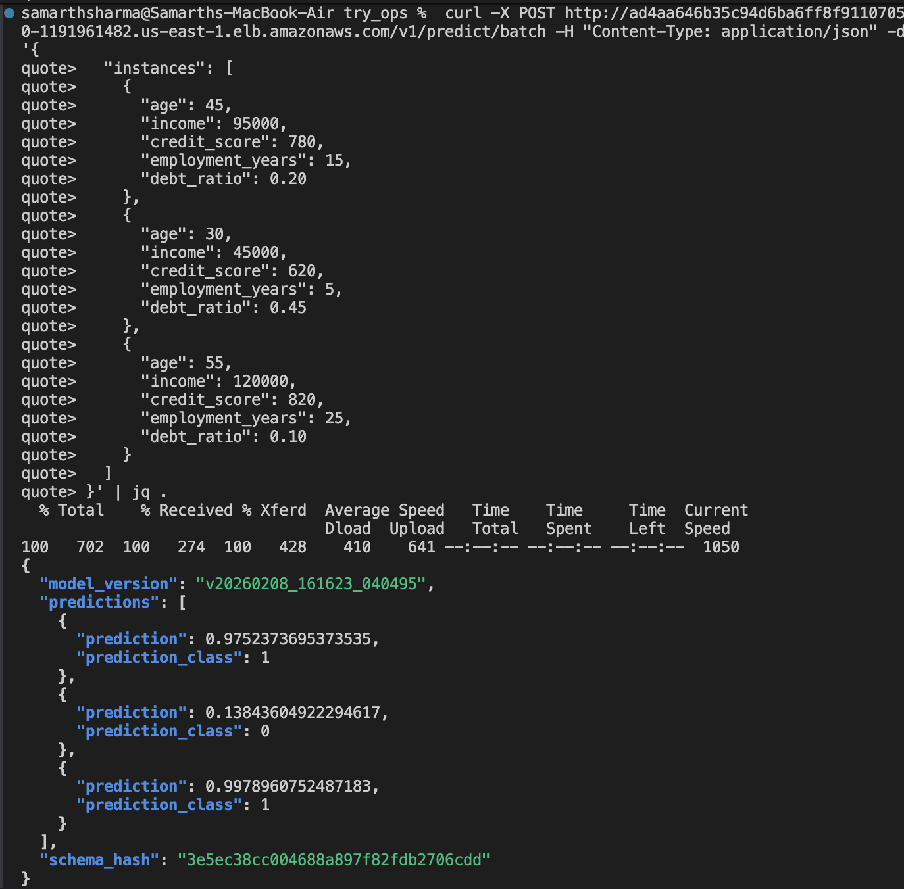
*Single prediction response showing approved prediction with 97.5% confidence*

**Request Validation:**

```python
class PredictionRequest(BaseModel):
    features: dict[str, float]
    
    @field_validator('features')
    def validate_features(cls, v):
        # Check required features
        required = {'age', 'income', 'credit_score', 'employment_years', 'debt_ratio'}
        if set(v.keys()) != required:
            raise ValueError(f"Missing features: {required - set(v.keys())}")
        
        # Validate types and ranges
        if v['age'] < 18 or v['age'] > 100:
            raise ValueError("Age must be 18-100")
        if v['income'] < 0:
            raise ValueError("Income must be positive")
        if v['credit_score'] < 300 or v['credit_score'] > 850:
            raise ValueError("Credit score must be 300-850")
        
        return v
```

**Inference Execution:**

```python
def predict(self, features: dict[str, float]) -> dict:
    # 1. Convert to numpy array (feature order from metadata)
    feature_names = [f["name"] for f in self.metadata["features"]]
    input_array = np.array([[features[name] for name in feature_names]], dtype=np.float32)
    
    # 2. ONNX inference
    input_name = self.session.get_inputs()[0].name
    output_names = [o.name for o in self.session.get_outputs()]
    
    results = self.session.run(output_names, {input_name: input_array})
    
    # 3. Parse outputs
    # results[0] = class labels (e.g., [0] or [1])
    # results[1] = probabilities (e.g., [[0.025, 0.975]])
    
    prediction = int(results[0][0])
    probabilities = results[1][0].tolist()
    
    return {
        "prediction": "approved" if prediction == 1 else "rejected",
        "confidence": max(probabilities),
        "probabilities": {
            "rejected": probabilities[0],
            "approved": probabilities[1]
        },
        "model_version": self.current_version
    }
```

**Response Format:**

```json
{
  "prediction": "approved",
  "confidence": 0.975,
  "probabilities": {
    "rejected": 0.025,
    "approved": 0.975
  },
  "model_version": "v20260208_161623_2b35ca",
  "request_id": "a1b2c3d4-e5f6-4a7b-8c9d-0e1f2a3b4c5d",
  "timestamp": "2026-02-08T20:53:12.456789Z"
}
```

---

## Development Workflow

### Local Development Setup

**Prerequisites:**
- Python 3.13+
- UV package manager (`brew install uv` or `curl -LsSf https://astral.sh/uv/install.sh | sh`)
- Docker Desktop
- AWS CLI v2
- Terraform 1.5+
- kubectl

**Initial Setup:**

```bash
# Clone repository
git clone https://github.com/blue-samarth/mlops-tryops.git
cd mlops-tryops

# Create virtual environment
uv venv --python 3.13
source .venv/bin/activate  # or `.venv\Scripts\activate` on Windows

# Install dependencies
uv sync

# Install development dependencies
uv sync --group dev

# Verify installation
python -m pytest --version
python -m ruff --version
python -m mypy --version
```

**Environment Configuration:**

Create `.env` file:
```bash
ENVIRONMENT=development
LOG_LEVEL=DEBUG
LOCAL_STORAGE_MODE=true
S3_BUCKET=unused-in-local-mode
AWS_REGION=us-east-1
ENABLE_DRIFT_DETECTION=false
```

### Running Components Locally

**API Service:**

```bash
# Start API with hot-reload (development)
uvicorn src.api.main:app --reload --host 0.0.0.0 --port 8000

# Access
# - API: http://localhost:8000
# - Docs: http://localhost:8000/docs (Swagger UI)
# - ReDoc: http://localhost:8000/redoc
# - Health: http://localhost:8000/health
```

**Training Pipeline:**

```bash
# Generate dummy data
python scripts/generate_dummy_data.py --output data/training_data.csv --samples 5000

# Run training (local storage mode)
python -m src.train.train \
  --data data/training_data.csv \
  --target approved \
  --no-auto-promote  # Skip S3 upload

# Outputs:
# - models/v{timestamp}/model.onnx
# - metadata/v{timestamp}/metadata.json
# - baselines/v{timestamp}/*.json
```

**Monitoring Stack:**

```bash
# Start Prometheus + Grafana
docker-compose -f container_imgs/docker-compose.yml up -d

# Access
# - Prometheus: http://localhost:9090
# - Grafana: http://localhost:3000 (admin/admin)
```

### Testing

**Run All Tests:**

```bash
uv run pytest
```

**Run with Coverage:**

```bash
uv run pytest --cov=src --cov-report=html

# View coverage report
open htmlcov/index.html
```

**Run Specific Tests:**

```bash
# Test file
uv run pytest tests/test_api.py

# Test class
uv run pytest tests/test_api.py::TestPredictionEndpoint

# Test function
uv run pytest tests/test_api.py::TestPredictionEndpoint::test_predict_success
```

**Test Categories:**

- `tests/test_api.py` - API endpoint tests
- `tests/test_train.py` - Training pipeline tests
- `tests/test_utils.py` - Utility function tests
- `tests/test_monitoring.py` - Drift detection tests
- `tests/test_integration.py` - S3 integration tests (mocked)

### Code Quality

**Linting:**

```bash
# Check code style
uv run ruff check .

# Auto-fix issues
uv run ruff check --fix .

# Format code
uv run ruff format .
```

**Type Checking:**

```bash
uv run mypy src/
```

**Pre-Commit Checks:**

```bash
# Run all checks
./scripts/pre-commit.sh

# Checks performed:
# 1. Secrets scan (gitleaks)
# 2. Tests (pytest)
# 3. Coverage (90%/75%)
# 4. Linting (ruff)
# 5. Type checking (mypy)
# 6. Docker build verification
```

### Docker Development

**Build Images Locally:**

```bash
# API image
docker build \
  -f container_imgs/Dockerfile.api \
  -t mlops-api:local \
  --build-arg GIT_COMMIT=$(git rev-parse HEAD) \
  --build-arg BUILD_DATE=$(date -u +'%Y-%m-%dT%H:%M:%SZ') \
  .

# Training image
docker build \
  -f container_imgs/Dockerfile.train \
  -t mlops-training:local \
  --build-arg GIT_COMMIT=$(git rev-parse HEAD) \
  --build-arg BUILD_DATE=$(date -u +'%Y-%m-%dT%H:%M:%SZ') \
  .
```

**Run Containers Locally:**

```bash
# API container
docker run -p 8000:8000 \
  -e LOCAL_STORAGE_MODE=true \
  -e LOG_LEVEL=DEBUG \
  -v $(pwd)/models:/app/models \
  mlops-api:local

# Training container
docker run \
  -e LOCAL_STORAGE_MODE=true \
  -v $(pwd)/data:/app/data \
  -v $(pwd)/models:/app/models \
  mlops-training:local \
  --data /app/data/training_data.csv \
  --target approved
```

**Vulnerability Scanning:**

```bash
# Scan image
trivy image mlops-api:local

# Generate SARIF report
trivy image --format sarif --output trivy-results.sarif mlops-api:local

# Check specific severity
trivy image --severity HIGH,CRITICAL --exit-code 1 mlops-api:local
```

### Branching Strategy

**Branches:**
- `master` - Production deployments (protected)
- `develop` - Integration testing
- `feature/*` - Feature development
- `bugfix/*` - Bug fixes
- `hotfix/*` - Emergency production fixes

**Workflow:**

1. Create feature branch from develop
   ```bash
   git checkout develop
   git pull origin develop
   git checkout -b feature/add-monitoring
   ```

2. Develop and commit
   ```bash
   git add .
   git commit -m "feat: add Prometheus metrics for predictions"
   ```

3. Push and create PR
   ```bash
   git push origin feature/add-monitoring
   # Create PR to develop via GitHub UI
   ```

4. CI checks run automatically:
   - Secrets scan
   - Tests + coverage
   - Linting
   - Build verification

5. Code review and merge
6. Develop → Master PR for production deployment

### Commit Message Convention

Format: `<type>(<scope>): <subject>`

Types:
- `feat` - New feature
- `fix` - Bug fix
- `docs` - Documentation changes
- `style` - Code style changes (formatting)
- `refactor` - Code refactoring
- `test` - Test changes
- `chore` - Build/tooling changes
- `perf` - Performance improvements

Examples:
```
feat(api): add batch prediction endpoint
fix(train): correct ONNX conversion for multi-output models
docs(readme): update deployment instructions
refactor(utils): simplify S3 operations error handling
test(api): add integration tests for health endpoint
```

---

## Operational Procedures

### Deployment Process

**Initial Infrastructure Deployment:**

```bash
cd infra/

# Initialize Terraform
terraform init

# Review plan
terraform plan -out=deploy.tfplan

# Apply changes
terraform apply deploy.tfplan

# Configure kubectl
aws eks update-kubeconfig --region us-east-1 --name sam-mlops-production-eks

# Verify cluster
kubectl get nodes
kubectl get pods -n mlops
```

**Application Updates:**

1. Push code to master branch
2. GitHub Actions CI/CD runs automatically
3. Images built, scanned, signed, pushed to ECR
4. Update Terraform with new image (optional: use external data source)
5. Apply Terraform changes

**Manual Image Update:**

```bash
cd infra/

# Terraform will query ECR for latest SHA-tagged image
terraform plan

# Review image digest change
# Apply
terraform apply --auto-approve

# Monitor rollout
kubectl rollout status deployment -n mlops -l app.kubernetes.io/name=mlops-api
```

### Monitoring and Alerting

**Kubernetes Metrics:**

```bash
# Node metrics
kubectl top nodes

# Pod metrics
kubectl top pods -n mlops

# API pod logs
kubectl logs -n mlops -l app.kubernetes.io/name=mlops-api --tail=100 -f

# Training job logs
kubectl logs -n mlops -l job-name=training-manual-20260208-210646 --follow
```

**Prometheus Queries:**

Request rate:
```promql
rate(api_requests_total[5m])
```

Average latency:
```promql
rate(api_request_duration_seconds_sum[5m]) / rate(api_request_duration_seconds_count[5m])
```

Error rate:
```promql
rate(api_errors_total[5m])
```

Drift score:
```promql
drift_score{feature="age"}
```

**CloudWatch Logs:**

```bash
# EKS control plane logs
aws logs tail /aws/eks/sam-mlops-production-eks/cluster --follow

# VPC flow logs
aws logs tail /aws/vpc/sam-mlops-production --follow

# Filter errors
aws logs filter-pattern /aws/eks/sam-mlops-production-eks/cluster --filter-pattern "ERROR"
```

### Scaling Operations

**Manual Scaling:**

```bash
# Scale API deployment
kubectl scale deployment -n mlops -l app.kubernetes.io/name=mlops-api --replicas=5

# Scale node group
aws eks update-nodegroup-config \
  --cluster-name sam-mlops-production-eks \
  --nodegroup-name sam-mlops-production-api-nodes \
  --scaling-config desiredSize=4,minSize=2,maxSize=10
```

**HPA Tuning:**

Edit `infra/helm_api.tf`:
```hcl
autoscaling:
  enabled: true
  minReplicas: 3      # Increase baseline
  maxReplicas: 20     # Higher ceiling
  targetCPUUtilizationPercentage: 60  # More aggressive scaling
```

Apply: `terraform apply`

### Backup and Disaster Recovery

**Model Backup:**

S3 versioning enabled - all model versions retained automatically.

Manual backup:
```bash
# Sync entire bucket to backup location
aws s3 sync s3://sam-mlops-production-models-521713274292 s3://mlops-backup-bucket/ --source-region us-east-1
```

**Kubernetes State Backup:**

```bash
# Export all resources
kubectl get all -n mlops -o yaml > mlops-backup.yaml

# Backup specific resources
kubectl get deployment,service,hpa -n mlops -o yaml > api-deployment-backup.yaml
```

**Terraform State Backup:**

Terraform state in local file - backup to S3:
```bash
aws s3 cp infra/terraform.tfstate s3://terraform-state-backup/mlops/$(date +%Y%m%d-%H%M%S)/terraform.tfstate
```

Production recommendation: Migrate to S3 backend with versioning.

### Incident Response

**API Degradation:**

1. Check HPA status: `kubectl get hpa -n mlops`
2. Check pod health: `kubectl get pods -n mlops -l app.kubernetes.io/name=mlops-api`
3. Inspect logs: `kubectl logs -n mlops <pod-name> --tail=100`
4. Check node capacity: `kubectl describe nodes`
5. Scale manually if needed: `kubectl scale deployment ...`

**Model Performance Degradation:**

1. Check drift metrics in Prometheus/Grafana
2. Review recent predictions: `kubectl logs -n mlops <api-pod> | grep "prediction"`
3. Rollback to previous model:
   ```python
   from src.utils.serving_pointer import ServingPointerManager
   pointer.promote_model(
       model_version="<previous-version>",
       promoted_by="ops-team",
       promotion_reason="Performance degradation incident"
   )
   ```
4. Verify rollback: API reloads within 5 minutes
5. Test predictions
6. Investigate failed model offline

**Training Job Failure:**

1. Check job status: `kubectl get jobs -n mlops`
2. Inspect pod: `kubectl describe pod -n mlops <training-pod>`
3. View logs: `kubectl logs -n mlops <training-pod>`
4. Common issues:
   - S3 permissions: Check service account IAM role
   - Data quality: Validate input CSV
   - Resource limits: Increase memory/CPU in CronJob spec
5. Manual retry: `kubectl create job --from=cronjob/training training-manual-$(date +%Y%m%d-%H%M%S) -n mlops`

### Cost Optimization

**Current Monthly Cost: ~$350-400**

Optimization strategies:

1. **Use Spot Instances for Training:**
   - Savings: 70% on training node costs (~$40/month)
   - Implementation: `capacity_type = "SPOT"` in node group

2. **Cluster Autoscaler:**
   - Scale nodes to zero during idle periods
   - Savings: ~$60/month (overnight/weekend)

3. **Fargate for API:**
   - Pay per pod instead of EC2 instances
   - Savings: Variable, depends on traffic

4. **Single NAT Gateway (Non-Production):**
   - Reduce from 3 to 1 NAT gateway
   - Savings: ~$65/month
   - Risk: Single point of failure

5. **Reserved Instances:**
   - 1-year commitment for predictable workloads
   - Savings: 40% on compute (~$50/month)

6. **S3 Lifecycle Policies:**
   - Move old models to Glacier after 90 days
   - Savings: ~$0.20/month (minimal with current data)

7. **CloudWatch Log Retention:**
   - Reduce retention to 30 days
   - Export to S3 for long-term storage
   - Savings: ~$2/month

### Security Procedures

**Rotate IAM Credentials:**

OIDC-based - no rotation needed. Temporary credentials expire after 1 hour.

**Update Image Signatures:**

Automatic on every build. No manual action required.

**Kyverno Policy Updates:**

```bash
# Check current policies
kubectl get clusterpolicy

# Audit policy violations
kubectl get policyreport -A

# Update policy (edit Terraform)
cd infra/
# Edit kubernetes_admission_control.tf
terraform apply
```

**Vulnerability Remediation:**

1. Trivy detects vulnerability in CI/CD
2. Update dependency in `pyproject.toml`
3. Run `uv lock` to update lockfile
4. Commit and push
5. CI/CD rebuilds images
6. Verify scan passes

**Certificate Rotation:**

EKS certificates managed by AWS - automatic rotation.

Cosign ephemeral certificates - no rotation needed (short-lived).

---

## Future Implementations and Roadmap

### Current Status

**Phase 1 (Completed):** Production EKS deployment with core MLOps capabilities
-  EKS 1.33 cluster with OIDC provider
-  API deployment with HPA (2-10 pods)
-  Training CronJob with auto-promotion
-  Kyverno admission control with image verification
-  S3 model storage with serving pointer pattern
-  GitHub Actions CI/CD with OIDC authentication
-  Prometheus metrics and drift detection

**Phase 2 (Planned):** Enhanced observability and security hardening

### Planned Enhancements

#### Advanced Security (High Priority)

**Dependency Management:**
- Implement Dependabot for automated dependency updates
- Auto-merge patch versions with comprehensive test coverage
- Security-only updates for production dependencies
- Weekly vulnerability scanning schedule

**Static Application Security Testing (SAST):**
- Deploy CodeQL for Python vulnerability scanning
- CWE detection (injection, XSS, hardcoded secrets)
- Auto-fix suggestions via pull requests
- Integration with GitHub Security tab

**Container Hardening:**
- Read-only root filesystem (`readOnlyRootFilesystem: true`)
- Drop all capabilities (`drop: ["ALL"]`)
- Distroless base images (no shell, minimal attack surface)
- Seccomp profiles to restrict syscalls
- AppArmor/SELinux enforcement

**Runtime Security:**
- AWS GuardDuty for threat detection (unusual API activity, crypto mining)
- AWS CloudTrail for audit logging (all API calls with log file validation)
- Malware scanning for uploaded model artifacts
- Network intrusion detection

**Supply Chain Security:**
- GitHub Actions version pinning (SHA-based, not @v4)
- SLSA Level 3 provenance attestation
- Software Bill of Materials (SBOM) generation
- Rekor transparency log verification

#### Observability Enhancements (Medium Priority)

**Distributed Tracing:**
- OpenTelemetry instrumentation for API and training
- Jaeger backend for trace collection
- Trace sampling (100% for errors, 1% for success)
- Service dependency mapping

**Advanced Monitoring:**
- CloudWatch Insights queries for log analysis
- SNS + PagerDuty integration for alerting
- SLO tracking: 99.9% availability, <200ms p95 latency
- Cost monitoring via AWS Cost Explorer with custom tags

**Centralized Logging:**
- Fluent Bit DaemonSet for log aggregation
- CloudWatch Logs with structured JSON format
- Log retention policies (30 days standard, 90 days audit)
- Export to S3 for long-term storage (compliance)

**Custom Dashboards:**
- Grafana dashboard for model performance metrics
- Real-time drift visualization
- Training pipeline execution tracking
- Cost attribution by workload

#### High Availability and Disaster Recovery (Medium Priority)

**Multi-Region Deployment:**
- Active-passive DR in us-west-2
- S3 cross-region replication for models
- Route53 health checks with failover routing
- RTO < 1 hour, RPO < 5 minutes

**Backup and Restore:**
- Automated EBS snapshots for persistent volumes
- Velero for Kubernetes cluster backups
- Point-in-time recovery for S3 versioned objects
- Quarterly DR testing procedures

**Chaos Engineering:**
- Chaos Mesh for fault injection testing
- Pod failure simulations
- Network partition testing
- AZ failure scenarios

#### Advanced ML Operations (Low Priority)

**Model Registry:**
- MLflow integration for experiment tracking
- Model versioning with lineage tracking
- A/B testing framework for model comparison
- Shadow deployments for canary validation

**Feature Store:**
- Feast for feature management
- Online/offline feature serving
- Feature versioning and lineage
- Point-in-time correctness for training

**Automated Model Retraining:**
- Drift-triggered retraining workflows
- Hyperparameter tuning with Optuna
- AutoML integration for baseline models
- Performance regression detection

**Explainability:**
- SHAP integration for prediction explanations
- LIME for local interpretability
- Model cards for documentation
- Bias detection in predictions

### Resource Optimization Strategy

**Current Approach:**
- Conservative initial sizing (t3.medium for both API and training)
- 2-week monitoring period to collect resource metrics
- Data-driven right-sizing based on empirical evidence

**Optimization Phases:**

**Phase 2A: Data Collection (Weeks 1-2)**
- Deploy Kubernetes Metrics Server
- Enable container insights for detailed resource tracking
- Log CPU, memory, disk I/O patterns
- Track training job durations and throughput

**Phase 2B: Analysis (Week 3)**
- Calculate average and peak resource utilization
- Identify bottlenecks (CPU-bound vs memory-bound vs I/O-bound)
- Determine optimal resource requests/limits
- Cost-benefit analysis of instance type upgrades

**Phase 2C: Implementation (Week 4)**
- Right-size node groups based on analysis
- Update resource requests/limits in Helm charts
- Enable Cluster Autoscaler for dynamic scaling
- Implement Vertical Pod Autoscaler for automatic tuning

**Target Metrics:**
- API nodes: CPU 60-80%, Memory 70-85%
- Training nodes: CPU 70-90%, Memory 75-90%
- Cost reduction: 20-40% through optimization

**Spot Instance Strategy:**
- Use Spot Instances for training workloads (70% cost savings)
- Fallback to on-demand for critical training runs
- Spot interruption handling with checkpointing

### Migration Roadmap

**Week 1-2: Enhanced Security**
- Configure Dependabot
- Deploy CodeQL SAST
- Implement container hardening (read-only filesystem, drop capabilities)
- Enable GuardDuty and CloudTrail

**Week 3-4: Advanced Monitoring**
- Deploy Fluent Bit for centralized logging
- Integrate OpenTelemetry for distributed tracing
- Create Grafana dashboards for ML-specific metrics
- Configure SNS alerting pipeline

**Week 5-6: High Availability**
- Implement multi-AZ redundancy validation
- Configure S3 cross-region replication
- Deploy Velero for cluster backups
- Document DR procedures

**Week 7-8: Resource Optimization**
- Collect and analyze resource utilization data
- Right-size node groups and pod resources
- Enable Cluster Autoscaler
- Implement cost allocation tags

### Success Criteria

**Security Hardening:**
- [ ] Zero CRITICAL/HIGH vulnerabilities in production
- [ ] Dependabot auto-merging patch updates
- [ ] CodeQL SAST passing on all PRs
- [ ] Read-only root filesystem enforced
- [ ] GuardDuty alerts configured
- [ ] CloudTrail logging all API calls

**Observability:**
- [ ] Distributed tracing capturing 100% errors, 1% success
- [ ] Centralized logs in CloudWatch
- [ ] Grafana dashboards displaying ML metrics
- [ ] PagerDuty integration for critical alerts
- [ ] SLO tracking: 99.9% uptime, <200ms p95 latency

**High Availability:**
- [ ] Multi-AZ redundancy validated
- [ ] S3 cross-region replication active
- [ ] DR procedures documented and tested
- [ ] RTO < 1 hour, RPO < 5 minutes

**Resource Optimization:**
- [ ] Resource utilization: CPU 70-85%, Memory 75-90%
- [ ] Cost reduction: 20-40% vs initial deployment
- [ ] Cluster Autoscaler operational
- [ ] Spot Instances for training (70% savings)

### Risks and Mitigations

| Risk | Impact | Probability | Mitigation |
|------|--------|-------------|------------|
| Dependency vulnerabilities | High | High | Automated Dependabot updates, vulnerability scanning |
| CloudTrail cost overrun | Medium | Medium | S3 lifecycle policies, selective event logging |
| Spot instance interruptions | Medium | High | Checkpointing, fallback to on-demand |
| Multi-region complexity | High | Low | Thorough testing in DR environment |
| Over-optimization resource limits | High | Medium | Gradual rollout, monitoring, rollback plan |
| Distributed tracing overhead | Low | Medium | Sampling strategy, performance testing |

### Technical Debt Items

**High Priority:**
- [ ] Migrate Terraform state to S3 backend with DynamoDB locking
- [ ] Implement External Secrets Operator for secrets management
- [ ] Add NetworkPolicies for pod-to-pod isolation
- [ ] Deploy Argo Rollouts for blue-green deployments

**Medium Priority:**
- [ ] Implement pod disruption budgets for all deployments
- [ ] Add pod priority classes for scheduling guarantees
- [ ] Deploy Istio service mesh for advanced traffic management
- [ ] Implement OPA Gatekeeper for additional policy enforcement

**Low Priority:**
- [ ] Add Falco for runtime threat detection
- [ ] Implement chaos engineering with Chaos Mesh
- [ ] Deploy Kubernetes Dashboard for visualization
- [ ] Add Kubernetes Event Exporter for event tracking

### Documentation Requirements

**Operational Runbooks (To Be Created):**
- Advanced incident response procedures
- Model rollback playbook with RCA template
- Scaling procedures for traffic spikes
- Disaster recovery execution checklist
- Security incident response workflow

**Architecture Diagrams (To Be Created):**
- Multi-region architecture
- Distributed tracing flow
- Disaster recovery architecture
- Cost optimization decision tree
- Security defense layers

**Compliance Documentation:**
- Data retention policies
- Audit log review procedures
- Vulnerability remediation SLAs
- Change management process

---

## Appendix

### Technology Stack Summary

| Component | Technology | Version | Purpose |
|-----------|-----------|---------|---------|
| Language | Python | 3.13 | Application code |
| Package Manager | UV | 0.9.7 | Dependency management |
| Web Framework | FastAPI | 0.128.0 | REST API |
| ML Library | scikit-learn | 1.8.0 | Model training |
| Model Format | ONNX | 1.20.1 | Cross-platform inference |
| Inference Engine | ONNX Runtime | 1.23.2 | Production serving |
| Container Runtime | Docker | 24.x | Image builds |
| Orchestration | Kubernetes | 1.33 (EKS) | Workload management |
| IaC | Terraform | 1.5+ | Infrastructure provisioning |
| CI/CD | GitHub Actions | - | Automation |
| Image Signing | Cosign | 2.4.1 | Supply chain security |
| Admission Control | Kyverno | 3.2.6 | Policy enforcement |
| Metrics | Prometheus | 2.x | Observability |
| Dashboards | Grafana | 10.x | Visualization |
| Cloud Provider | AWS | - | Infrastructure |
| Container Registry | ECR | - | Image storage |
| Object Storage | S3 | - | Model storage |
| Encryption | KMS | - | Data at rest |
| Networking | VPC | - | Network isolation |

### File Structure Reference

```
.
├── .github/
│   └── workflows/
│       ├── ci.yml (Quality gates)
│       └── cd.yml (Build and deploy)
├── container_imgs/
│   ├── Dockerfile.api (API container)
│   ├── Dockerfile.train (Training container)
│   ├── docker-compose.yml (Local monitoring)
│   ├── prometheus.yml (Prometheus config)
│   ├── grafana/
│   │   ├── dashboards/
│   │   │   └── mlops-overview.json (Dashboard definition)
│   │   └── provisioning/
│   │       ├── dashboards/
│   │       │   └── default.yml (Dashboard provisioning)
│   │       └── datasources/
│   │           └── prometheus.yml (Datasource config)
│   └── README.md
├── data/
│   ├── training_data.csv (Generated training data)
│   ├── test_data.csv (Test fixtures)
│   └── drifted_data.csv (Drift detection test data)
├── helm/
│   ├── api/
│   │   └── templates/ (Kubernetes manifests for API)
│   └── training/
│       └── templates/ (Kubernetes manifests for training)
├── htmlcov/ (Test coverage HTML reports)
├── imgs/ (Infrastructure screenshots)
│   ├── api_prediction_responce.png
│   ├── ecr_pvt_repos.png
│   ├── k8s_add_ons.png
│   ├── localdeployment_metrics.png
│   ├── node_groups_ie_api_and_training.png
│   ├── s3_bucket_containing_models.png
│   └── vpc.png
├── infra/
│   ├── aws_eks_cluster.tf (EKS cluster)
│   ├── aws_eks_node_groups.tf (Node groups)
│   ├── aws_eks_addons.tf (EKS addons)
│   ├── aws_eks_iam.tf (IRSA roles)
│   ├── aws_vpc.tf (VPC networking)
│   ├── aws_storage_bucket.tf (S3 buckets)
│   ├── aws_img_registry.tf (ECR repositories)
│   ├── aws_iam_ga_runners.tf (GitHub Actions OIDC)
│   ├── aws_iam_logs.tf (CloudWatch logging)
│   ├── helm_api.tf (API deployment)
│   ├── helm_training.tf (Training CronJob)
│   ├── kubernetes_admission_control.tf (Kyverno)
│   ├── kubernetes_namespace.tf (Namespace)
│   ├── github_integration.tf (GitHub secrets)
│   ├── github_infra/
│   │   ├── github_secrets.tf
│   │   ├── github_variables.tf
│   │   ├── github_pat_script.sh
│   │   └── README.md
│   ├── locals.tf (Shared variables)
│   ├── variables.tf (Input variables)
│   ├── outputs.tf (Terraform outputs)
│   ├── terraform.tfvars (Configuration)
│   ├── terraform.tfstate (State file)
│   ├── INFRASTRUCTURE_DOCUMENTATION.md
│   ├── INFRASTRUCTURE_PLAN.md
│   └── GITHUB_SETUP.md
├── models/ (Local storage mode)
│   ├── baselines/
│   ├── metadata/
│   └── models/
├── scripts/
│   └── generate_dummy_data.py (Data generation)
├── src/
│   ├── api/ (FastAPI service)
│   ├── train/ (Training pipeline)
│   ├── monitoring/ (Observability)
│   └── utils/ (Shared utilities)
├── tests/
│   ├── integration/
│   │   └── test_api.py
│   ├── test_critical_fixes.py
│   ├── test_drift_detector.py
│   ├── test_drift_detector_extended.py
│   ├── test_drift_service.py
│   ├── test_main.py
│   ├── test_model_loader.py
│   ├── test_model_storage.py
│   ├── test_prediction_logger.py
│   ├── test_s3_operations.py
│   ├── test_schema_generator.py
│   ├── test_serving_pointer.py
│   ├── test_train.py
│   └── conftest.py (Test fixtures)
├── pyproject.toml (Python project config)
├── uv.lock (Locked dependencies)
├── pytest.ini (Test configuration)
├── run_api.sh (Local API runner)
├── run.sh (Local runner)
├── test_api.py (API test script)
├── all_python_files.txt (Python files inventory)
├── README.md (Original README)
├── COMPREHENSIVE_README.md (This document)
├── TECHNICAL_DOCUMENTATION.md (Technical specs)
└── TECHNICAL_DOCUMENTATION.html (HTML version)
```

### Glossary

**ONNX (Open Neural Network Exchange):** Cross-platform model format enabling framework interoperability. Models trained in scikit-learn can be deployed with ONNX Runtime for optimized inference.

**IRSA (IAM Roles for Service Accounts):** Kubernetes feature allowing pods to assume IAM roles via OIDC, providing fine-grained AWS permissions without node-level credentials.

**Kyverno:** Kubernetes-native policy engine that validates, mutates, and generates resources. Used for admission control (image signature verification, security policies).

**Cosign:** Tool for signing and verifying container images using cryptographic signatures. Keyless mode leverages OIDC and Fulcio CA for ephemeral key pairs.

**BuildKit:** Modern Docker build engine with parallel builds, cache mounts, and improved layer optimization. Enabled via `DOCKER_BUILDKIT=1`.

**HPA (Horizontal Pod Autoscaler):** Kubernetes controller that automatically scales pod replicas based on CPU utilization or custom metrics.

**Serving Pointer:** Design pattern where a JSON file (serving/production.json) points to the current production model version, enabling atomic updates and rollbacks.

**Drift Detection:** Monitoring production prediction distributions against training baseline to detect data quality issues or model degradation.

**UV:** Fast Rust-based Python package manager, 10-100x faster than pip for dependency resolution.

**ECR (Elastic Container Registry):** AWS-managed Docker registry with vulnerability scanning, encryption, and IAM integration.

**VPC Endpoint:** Private connection between VPC and AWS services without traversing the internet, reducing costs and enhancing security.

---

**Document Version:** 1.0  
**Last Updated:** 2026-02-08  
**Maintained By:** MLOps Team  
**Repository:** [blue-samarth/mlops-tryops](https://github.com/blue-samarth/mlops-tryops)  
**Contact:** Repository Issues
