# MLOps Model Serving System - Technical Documentation

**Version:** 1.0.0  
**Last Updated:** January 26, 2026  
**Document Type:** Comprehensive Technical Reference

---

## Table of Contents

1. [System Architecture](#1-system-architecture)
2. [Security Hardening](#2-security-hardening)
3. [Configuration Management](#3-configuration-management)
4. [Storage Layer](#4-storage-layer)
5. [Training Pipeline](#5-training-pipeline)
6. [API Layer](#6-api-layer)
7. [Model Serving](#7-model-serving)
8. [Monitoring & Drift Detection](#8-monitoring--drift-detection)
9. [Deployment Guide](#9-deployment-guide)

---

## 1. System Architecture

### Overview

Production-grade ML inference platform for serving logistic regression models with comprehensive monitoring, drift detection, and hot-reloading capabilities.

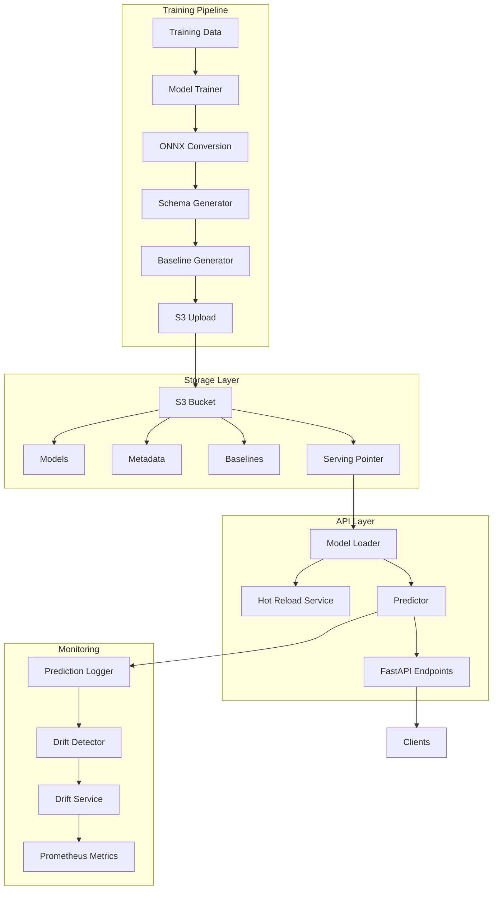

### Technology Stack

| Component | Technology | Purpose |
|-----------|-----------|---------|
| **API Framework** | FastAPI | Async HTTP server with auto-docs |
| **Inference Engine** | ONNX Runtime | Cross-platform model execution |
| **Storage** | AWS S3 + Boto3 | Centralized artifact repository |
| **ML Framework** | scikit-learn | Model training |
| **Monitoring** | Prometheus | Metrics collection and alerting |
| **Testing** | pytest + pytest-cov | Unit and integration tests |

### Design Principles

- **Type Safety:** Python type hints throughout
- **Immutability:** Configuration loaded once at startup
- **Thread Safety:** All shared state protected by locks
- **Fail-Safe:** Graceful degradation when optional components fail
- **Observable:** Comprehensive logging and metrics

---

## 2. Security Hardening

### 2.1 Critical Security Fixes (P0/P1)

#### Input Validation & Sanitization

**File:** `src/api/services/predictor.py`

**Protection Against:** Adversarial attacks, model poisoning via inf/nan values

```python
# All prediction inputs validated for inf/nan
if not np.isfinite(X).all():
    invalid_features = [
        feature_names[i]
        for i in range(X.shape[1])
        if not np.isfinite(X[:, i]).all()
    ]
    raise ValueError(f"Invalid values (inf/nan) in features: {invalid_features}")
```

**Security Benefits:**
- Prevents model poisoning attacks
- Blocks adversarial inputs (infinity values)
- Protects against NaN propagation in calculations
- Provides specific error messages for debugging

---

#### Request Size Limits (DoS Prevention)

**File:** `src/api/schemas/prediction.py`

**Protection Against:** Denial-of-Service attacks via oversized requests

| Limit | Value | Purpose |
|-------|-------|--------|
| Max features per request | 100 | Prevent memory exhaustion |
| Max feature name length | 256 chars | Prevent buffer overflow |
| Max batch size | 1000 | Rate limiting |

```python
@field_validator('features')
@classmethod
def validate_features(cls, v: dict[str, Any]) -> dict[str, Any]:
    if len(v) > 100:
        raise ValueError(f"Too many features ({len(v)}). Maximum 100 allowed.")
    
    for key in v.keys():
        if len(str(key)) > 256:
            raise ValueError(f"Feature name too long: {str(key)[:50]}...")
    
    return v
```

---

#### Request ID Injection Prevention

**File:** `src/api/middleware.py`

**Protection Against:** Log injection, path traversal, SQL injection via headers

```python
# Regex validation for request IDs
REQUEST_ID_PATTERN = re.compile(r'^[a-zA-Z0-9\-]{8,128}$')

# Client-provided IDs validated before use
if client_request_id:
    if REQUEST_ID_PATTERN.match(client_request_id):
        request_id = client_request_id
    else:
        # Generate safe ID and log warning
        request_id = str(uuid.uuid4())
        logger.warning(f"Invalid X-Request-ID rejected: {client_request_id[:50]}")
```

**Blocked Patterns:**
- Path traversal: `../../etc/passwd`
- SQL injection: `'; DROP TABLE users; --`
- Log injection: Newlines, control characters
- Special characters: `@#$%^&*()`

---

### 2.2 Reliability Improvements

#### Memory Leak Prevention

**File:** `src/api/services/model_loader.py`

**Issue:** Temporary ONNX files accumulated in `/tmp/mlops_models/`, causing disk exhaustion

**Fix:**
```python
try:
    session_options = ort.SessionOptions()
    self.model = ort.InferenceSession(local_model_path, session_options)
    self.metadata = self.model_storage.get_model_metadata(model_version)
    self.baseline = self.model_storage.get_baseline_stats(model_version)
finally:
    # Clean up temporary file to prevent disk space exhaustion
    try:
        Path(local_model_path).unlink()
        logger.debug(f"Cleaned up temp model file: {local_model_path}")
    except Exception as e:
        logger.warning(f"Failed to clean up temp file: {e}")
```

**Impact:**
- Prevents disk space exhaustion
- Cleanup happens even on failures
- Typical temp file size: 5-50MB per model

---

#### Race Condition Fix (TOCTOU)

**File:** `src/api/services/model_loader.py`

**Issue:** Version check outside lock created time-of-check-to-time-of-use vulnerability

**Before:**
```python
if new_version != self.current_version:  # Check outside lock
    logger.info(f"Detected new version: {new_version}")
    self._load_model_from_pointer(pointer)  # Use inside lock
```

**After:**
```python
# Check version inside lock to prevent race condition
should_reload = False
with self.model_lock:
    if new_version != self.current_version:
        should_reload = True

if should_reload:
    self._load_model_from_pointer(pointer)
```

**Benefits:**
- Prevents concurrent reloads
- Atomic version checking
- Thread-safe hot-reload

---

### 2.3 Data Integrity Improvements

#### PSI Calculation Normalization

**File:** `src/monitoring/drift_detector.py`

**Issue:** PSI calculation missing distribution normalization, causing incorrect drift scores

**Fix:**
```python
def _calculate_psi(self, actual, expected, epsilon=1e-10):
    # Normalize to probabilities (must sum to 1)
    actual = actual / actual.sum()
    expected = expected / expected.sum()
    
    # Add epsilon to avoid log(0)
    actual = np.maximum(actual, epsilon)
    expected = np.maximum(expected, epsilon)
    
    psi = np.sum((actual - expected) * np.log(actual / expected))
    return float(psi)
```

**Impact:**
- Correct PSI values (0 = no drift, >0.2 = significant)
- Reliable drift detection thresholds
- Comparable across different bin sizes

---

#### Baseline Sample Reproducibility

**File:** `src/monitoring/drift_detector.py`

**Improvements:**
1. **Seeded random generation** for reproducible baselines
2. **Bounds clipping** to respect min/max constraints

```python
def _generate_baseline_samples(self, seed: int = 42) -> dict[str, np.ndarray]:
    np.random.seed(seed)  # Reproducible samples
    samples = {}
    
    for feature_name, stats in feature_stats.items():
        mean = stats.get("mean", 0)
        std = stats.get("std", 1)
        min_val = stats.get("min", -np.inf)
        max_val = stats.get("max", np.inf)
        
        raw_samples = np.random.normal(mean, std, size=10000)
        samples[feature_name] = np.clip(raw_samples, min_val, max_val)  # Respect bounds
    
    return samples
```

**Benefits:**
- Reproducible drift tests
- Realistic baseline distributions
- Prevents out-of-range artifacts

---

#### Schema Hash Collision Resistance

**File:** `src/train/schema_generator.py`

**Change:** Increased hash from 64 bits (16 hex chars) to 128 bits (32 hex chars)

```python
# Before: 64-bit hash (collision probability: 2^-32 ≈ 10^-10)
return hashlib.sha256(schema_str.encode()).hexdigest()[:16]

# After: 128-bit hash (collision probability: 2^-64 ≈ 10^-19)
return hashlib.sha256(schema_str.encode()).hexdigest()[:32]
```

**Collision Probability:**
- 64-bit: ~1 in 4 billion (risky at scale)
- 128-bit: ~1 in 340 undecillion (industry standard)

---

#### Snapshot Deep Copy Protection

**File:** `src/monitoring/prediction_logger.py`

**Issue:** Shallow copy allowed external mutation of internal buffer

**Fix:**
```python
import copy

def get_snapshot(self, window_size: int | None = None) -> list[dict[str, Any]]:
    with self.lock:
        if window_size is None:
            return copy.deepcopy(list(self.buffer))  # Deep copy
        else:
            snapshot = list(self.buffer)[-window_size:]
            return copy.deepcopy(snapshot)  # Deep copy
```

**Benefits:**
- Prevents accidental buffer corruption
- Thread-safe snapshots
- Immutable drift analysis data

---

### 2.4 Security Testing

**Test Suite:** `tests/test_critical_fixes.py` (16 tests, 100% pass)

| Test Category | Tests | Coverage |
|---------------|-------|----------|
| Input Validation | 3 | inf/nan rejection |
| Request Size Limits | 3 | DoS prevention |
| Request ID Validation | 2 | Injection prevention |
| PSI Normalization | 2 | Correct calculations |
| Baseline Reproducibility | 2 | Seeding & clipping |
| Schema Hash | 2 | Collision resistance |
| Deep Copy Protection | 2 | Buffer immutability |

**Run tests:**
```bash
uv run pytest tests/test_critical_fixes.py -v
```

---

## 3. Configuration Management

### Settings Class

**File:** `src/utils/config.py`

Pydantic-based configuration with environment variable support.

#### Core Settings

| Setting | Type | Default | Description |
|---------|------|---------|-------------|
| `AWS_REGION` | str | "us-east-1" | AWS region for S3 |
| `S3_BUCKET` | str | "mlops-project-models" | S3 bucket name |
| `ENVIRONMENT` | str | "production" | Deployment environment |
| `MODEL_RELOAD_INTERVAL` | int | 300 | Hot-reload check interval (seconds) |
| `API_HOST` | str | "0.0.0.0" | API server host |
| `API_PORT` | int | 8000 | API server port |
| `MAX_BATCH_SIZE` | int | 1000 | Maximum batch prediction size |
| `RATE_LIMIT` | str | "100/minute" | Default API rate limit |

#### Drift Detection Settings

| Setting | Type | Default | Description |
|---------|------|---------|-------------|
| `DRIFT_CHECK_INTERVAL` | int | 3600 | Drift check interval (seconds) |
| `DRIFT_WINDOW_SIZE` | int | 1000 | Predictions per drift analysis |
| `DRIFT_PSI_THRESHOLD` | float | 0.2 | PSI alert threshold |
| `DRIFT_KS_THRESHOLD` | float | 0.1 | KS test p-value threshold |
| `ENABLE_DRIFT_DETECTION` | bool | True | Enable/disable drift monitoring |

#### PSI Threshold Interpretation

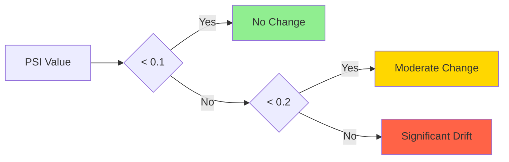

**Usage:**

```python
from src.utils.config import settings

print(f"Environment: {settings.ENVIRONMENT}")
print(f"Drift threshold: {settings.DRIFT_PSI_THRESHOLD}")
```

---

## 3. Storage Layer

### 3.1 S3 Operations

**File:** `src/utils/s3_operations.py`

Low-level S3 wrapper with exponential backoff retry.

#### Class: `S3Operations`

**Constructor:**
```python
def __init__(
    bucket_name: str,
    region_name: str | None = None
) -> None
```

#### Key Methods

| Method | Signature | Returns | Description |
|--------|-----------|---------|-------------|
| `upload_file` | `(local_path: str, s3_key: str, metadata: dict \| None, content_type: str \| None)` | `bool` | Upload file with metadata |
| `download_file` | `(s3_key: str, local_path: str)` | `bool` | Download to local path |
| `upload_json` | `(data: dict, s3_key: str)` | `bool` | Serialize and upload JSON |
| `download_json` | `(s3_key: str)` | `dict \| None` | Download and parse JSON |
| `object_exists` | `(s3_key: str)` | `bool` | Check object existence |
| `list_objects` | `(prefix: str, max_keys: int)` | `list[str]` | List objects by prefix |

#### Retry Logic

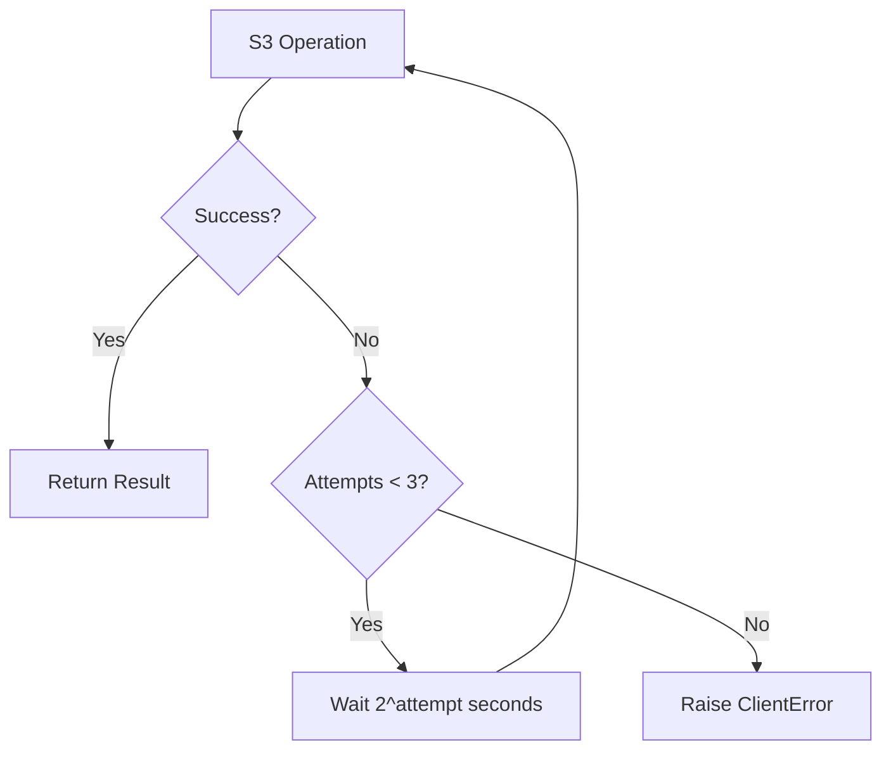

**Retry Configuration:**
- **Attempts:** 3
- **Wait Strategy:** Exponential backoff (2s → 4s → 8s)
- **Max Wait:** 10 seconds
- **Library:** `tenacity`

**Usage:**

```python
s3_ops = S3Operations("mlops-bucket", "us-east-1")

# Upload model
success = s3_ops.upload_file(
    "/tmp/model.onnx",
    "models/v20250126_120000_abc123.onnx",
    metadata={"version": "v20250126_120000_abc123"}
)

# Download metadata
metadata = s3_ops.download_json("metadata/v20250126_120000_abc123.json")
```

### 3.2 Model Storage

**File:** `src/utils/model_storage.py`

High-level abstraction for ML artifact management.

#### S3 Key Conventions

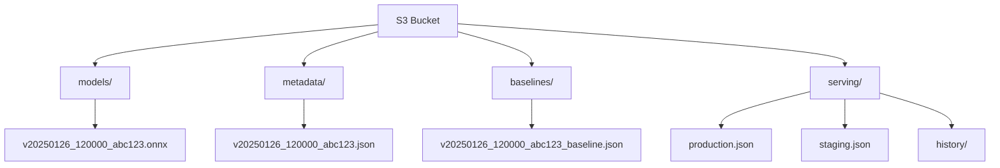

#### Class: `ModelStorage`

**Key Methods:**

| Method | Purpose | S3 Key Pattern |
|--------|---------|----------------|
| `upload_model` | Upload ONNX model | `models/{version}.onnx` |
| `upload_metadata` | Upload model metadata | `metadata/{version}.json` |
| `upload_baseline` | Upload drift baseline | `baselines/{version}_baseline.json` |
| `download_model` | Download model file | `models/{version}.onnx` |
| `get_model_metadata` | Fetch metadata | `metadata/{version}.json` |
| `get_baseline_stats` | Fetch baseline | `baselines/{version}_baseline.json` |
| `list_model_versions` | List all versions | `models/*.onnx` |

**Usage:**

```python
storage = ModelStorage(s3_ops)

# Upload artifacts
model_uri = storage.upload_model("/tmp/model.onnx", "v20250126_120000_abc123")
metadata_uri = storage.upload_metadata(metadata_dict, "v20250126_120000_abc123")
baseline_uri = storage.upload_baseline(baseline_dict, "v20250126_120000_abc123")

# Download for serving
storage.download_model("v20250126_120000_abc123", "/tmp/serving_model.onnx")
```

### 3.3 Serving Pointer

**File:** `src/utils/serving_pointer.py`

Atomic model promotion and rollback system.

#### Serving Pointer Pattern

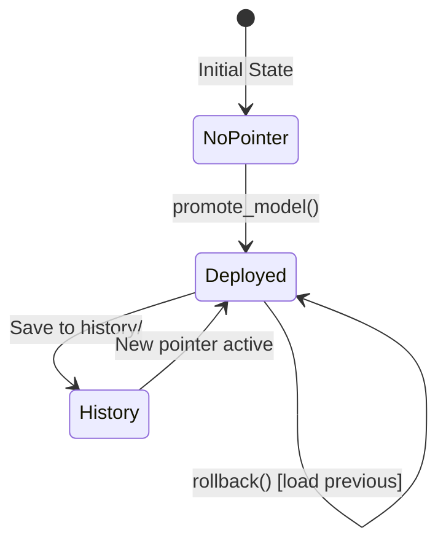

#### Pointer Structure

| Field | Type | Description |
|-------|------|-------------|
| `model_version` | str | Version identifier |
| `model_path` | str | S3 URI to ONNX file |
| `metadata_path` | str | S3 URI to metadata |
| `baseline_path` | str | S3 URI to baseline |
| `schema_hash` | str | Schema version hash |
| `promoted_at` | str | ISO 8601 timestamp |
| `promoted_by` | str | User/system identifier |
| `promotion_reason` | str | Justification |
| `previous_version` | str | Previous version |
| `rollback_to` | str | Rollback target |

#### Class: `ServingPointerManager`

**Methods:**

```python
def get_current_pointer() -> dict[str, Any] | None
def promote_model(
    model_version: str,
    promoted_by: str = "system",
    promotion_reason: str = ""
) -> dict[str, Any]
def rollback() -> dict[str, Any]
def get_promotion_history(limit: int = 10) -> list[dict[str, Any]]
def validate_pointer(pointer: dict[str, Any]) -> bool
```

**Promotion Workflow:**

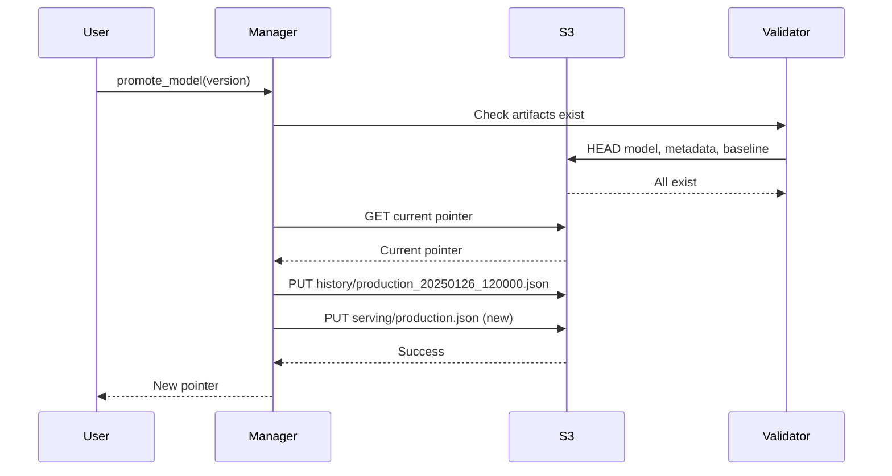

**Usage:**

```python
manager = ServingPointerManager("mlops-bucket", "production")

# Promote new model
pointer = manager.promote_model(
    model_version="v20250126_120000_abc123",
    promoted_by="data_scientist_alice",
    promotion_reason="Accuracy improved from 0.92 to 0.95"
)

# Rollback if needed
if error_rate > THRESHOLD:
    rollback_pointer = manager.rollback()
```

---

## 4. Training Pipeline

### 4.1 Schema Generation

**File:** `src/train/schema_generator.py`

Structural schema generation with hash-based versioning.

#### Schema Components

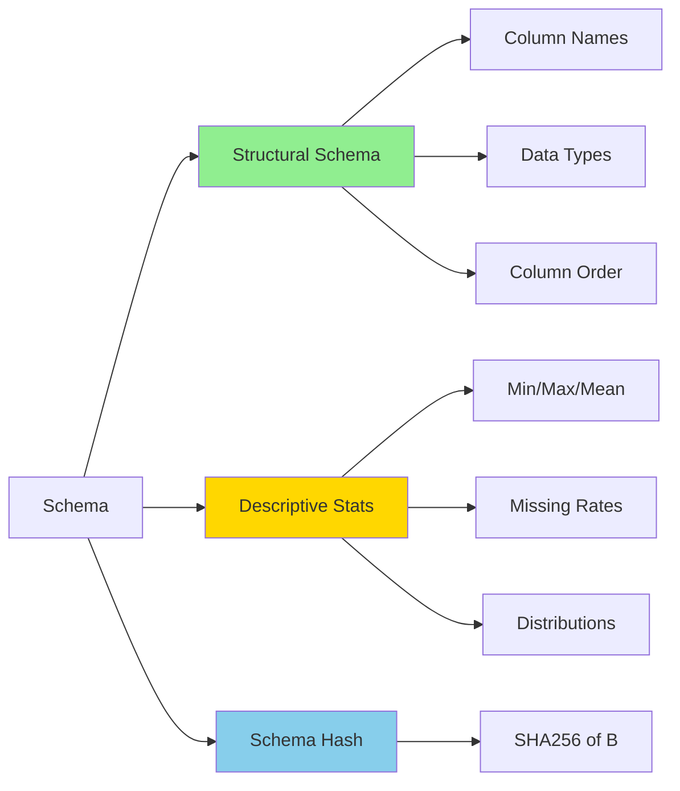

#### Class: `SchemaGenerator`

**Key Method:**

```python
@staticmethod
def generate_schema(
    data: pd.DataFrame,
    target_column: str | None = None
) -> dict[str, Any]
```

**Returns:**

| Field | Type | Description |
|-------|------|-------------|
| `structural_schema` | list[dict] | Column definitions (name, position, dtype) |
| `descriptive_stats` | dict | Per-feature statistics |
| `schema_hash` | str | 16-char hash of structural schema only |
| `n_features` | int | Number of features |
| `feature_names` | list[str] | Feature names in order |

**Structural Schema Example:**

```python
[
    {"name": "age", "position": 0, "dtype": "int64"},
    {"name": "income", "position": 1, "dtype": "float64"},
    {"name": "city", "position": 2, "dtype": "object"}
]
```

**Descriptive Stats Example:**

```python
{
    "age": {
        "type": "numeric",
        "min": 18.0,
        "max": 85.0,
        "mean": 45.2,
        "std": 12.3,
        "num_missing": 5,
        "missing_rate": 0.005
    },
    "city": {
        "type": "categorical",
        "num_unique": 5,
        "num_missing": 0,
        "missing_rate": 0.0
    }
}
```

**Hash Stability:**

```python
# Same structure → Same hash (even if stats change)
schema1 = generate_schema(train_data_2024)  # hash: "a1b2c3d4e5f6g7h8"
schema2 = generate_schema(train_data_2025)  # hash: "a1b2c3d4e5f6g7h8"

# Different structure → Different hash
schema3 = generate_schema(train_data_with_new_feature)  # hash: "x9y8z7w6v5u4t3s2"
```

### 4.2 Baseline Generation

**Files:** 
- `src/train/feature_baseline_generator.py`
- `src/train/prediction_baseline_generator.py`
- `src/train/baseline_generator.py`

#### Baseline Components

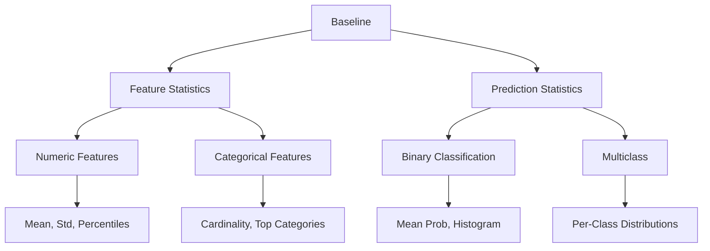

#### Feature Baseline Structure

| Feature Type | Statistics Captured |
|--------------|-------------------|
| **Numeric** | mean, std, min, max, percentiles (p25, p50, p75, p95), missing_rate |
| **Categorical** | n_unique, top_categories (top 10), missing_rate |

#### Prediction Baseline Structure

**Binary Classification:**

```python
{
    "type": "binary_classification",
    "mean_probability": 0.65,
    "std_probability": 0.23,
    "percentiles": {"p25": 0.48, "p50": 0.65, "p75": 0.82, "p95": 0.95},
    "histogram": {
        "counts": [10, 25, 50, ...],
        "bin_edges": [0.0, 0.05, 0.1, ...]
    }
}
```

**Multiclass:**

```python
{
    "type": "multiclass_classification",
    "n_classes": 3,
    "class_distributions": [
        {"class_idx": 0, "mean": 0.33, "std": 0.25},
        {"class_idx": 1, "mean": 0.35, "std": 0.22},
        {"class_idx": 2, "mean": 0.32, "std": 0.24}
    ]
}
```

**Usage:**

```python
from src.train.baseline_generator import BaselineGenerator

# Generate comprehensive baseline
baseline_gen = BaselineGenerator(X_test, y_pred_proba)
baseline = baseline_gen.generate_baseline()

# Structure:
# {
#     "n_samples": 2000,
#     "feature_statistics": {...},
#     "prediction_statistics": {...}
# }
```

### 4.3 Model Trainer

**File:** `src/train/train.py`

End-to-end training pipeline with ONNX conversion.

#### Training Workflow

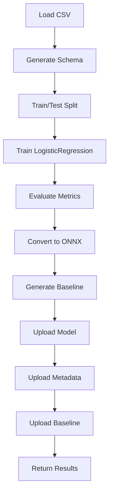

#### Class: `ModelTrainer`

**Main Method:**

```python
def train(
    data_path: str,
    target_column: str = "target",
    test_size: float = 0.2,
    random_state: int = 42
) -> dict[str, Any]
```

**Returns:**

```python
{
    "model_version": "v20250126_120000_abc123",
    "model_uri": "s3://bucket/models/v20250126_120000_abc123.onnx",
    "metadata_uri": "s3://bucket/metadata/v20250126_120000_abc123.json",
    "baseline_uri": "s3://bucket/baselines/v20250126_120000_abc123_baseline.json",
    "metrics": {
        "accuracy": 0.9523,
        "precision": 0.9312,
        "recall": 0.9401,
        "f1_score": 0.9356,
        "roc_auc": 0.9734
    },
    "training_duration": 12.45
}
```

#### Version Generation

**Function:** `generate_model_version()`

**Format:** `v{YYYYMMDD}_{HHMMSS}_{hash6}`

**Example:** `v20250126_143022_abc123`

**Components:**
- **Date:** YYYYMMDD (UTC)
- **Time:** HHMMSS (UTC)
- **Hash:** First 6 chars of SHA256

#### ONNX Conversion

**Configuration:**

```python
initial_type = [('float_input', FloatTensorType([None, n_features]))]
onnx_model = convert_sklearn(
    model,
    initial_types=initial_type,
    target_opset=12  # Broad compatibility
)
```

**Supported Runtimes:**
- ONNX Runtime 1.6+
- TensorFlow 2.3+
- PyTorch 1.7+

**Usage:**

```python
trainer = ModelTrainer(s3_bucket="mlops-production-models")

results = trainer.train(
    data_path="data/customer_churn.csv",
    target_column="churn",
    test_size=0.25
)

print(f"Model: {results['model_version']}")
print(f"Accuracy: {results['metrics']['accuracy']:.3f}")
```

---

## 5. API Layer

### 5.1 Application Structure

**File:** `src/api/main.py`

FastAPI application with async lifespan management.

#### Application Lifecycle

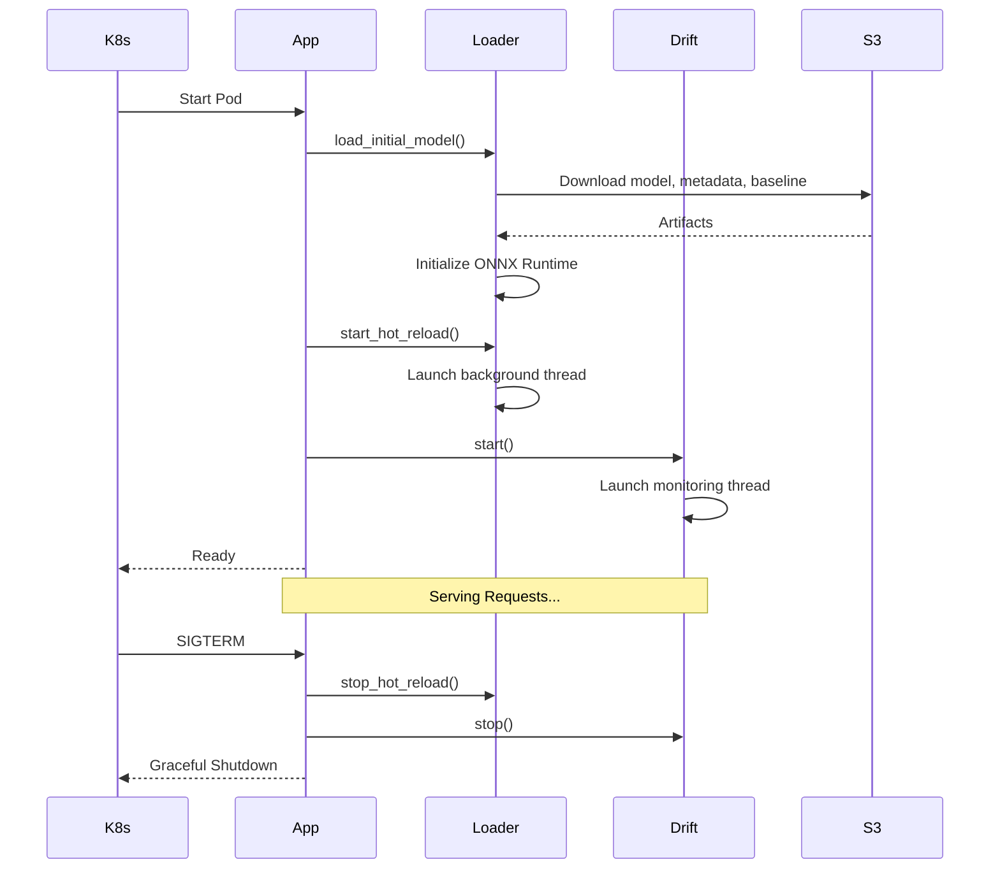

#### Middleware Stack

| Order | Middleware | Purpose |
|-------|-----------|---------|
| 1 | `RequestIDMiddleware` | Add X-Request-ID for tracing |
| 2 | `CORSMiddleware` | Enable cross-origin requests |
| 3 | `SlowAPI` | Rate limiting by IP |

#### Endpoints

| Method | Path | Rate Limit | Description |
|--------|------|------------|-------------|
| GET | `/` | None | API info |
| GET | `/health` | None | Health check (always 200) |
| GET | `/ready` | None | Readiness probe (503 if not ready) |
| GET | `/metrics` | None | Prometheus metrics |
| POST | `/v1/predict` | 50/min | Single prediction |
| POST | `/v1/predict/batch` | 20/min | Batch predictions |
| GET | `/v1/model/info` | None | Model metadata |

### 5.2 Request/Response Schemas

**File:** `src/api/schemas/prediction.py`

#### Prediction Request

```python
class PredictRequest(BaseModel):
    features: dict[str, Any]
    
# Example:
{
    "features": {
        "age": 45,
        "income": 75000,
        "credit_score": 720
    }
}
```

#### Prediction Response

```python
class PredictResponse(BaseModel):
    model_version: str
    prediction: int
    probability: float
    schema_hash: str
    
# Example:
{
    "model_version": "v20250126_120000_abc123",
    "prediction": 1,
    "probability": 0.85,
    "schema_hash": "a1b2c3d4e5f6g7h8"
}
```

#### Batch Request/Response

```python
class BatchPredictRequest(BaseModel):
    features_list: list[dict[str, Any]]  # Max 1000
    
class BatchPredictResponse(BaseModel):
    model_version: str
    predictions: list[dict[str, Any]]  # [{"prediction": 1, "probability": 0.85}, ...]
    schema_hash: str
```

### 5.3 Error Handling

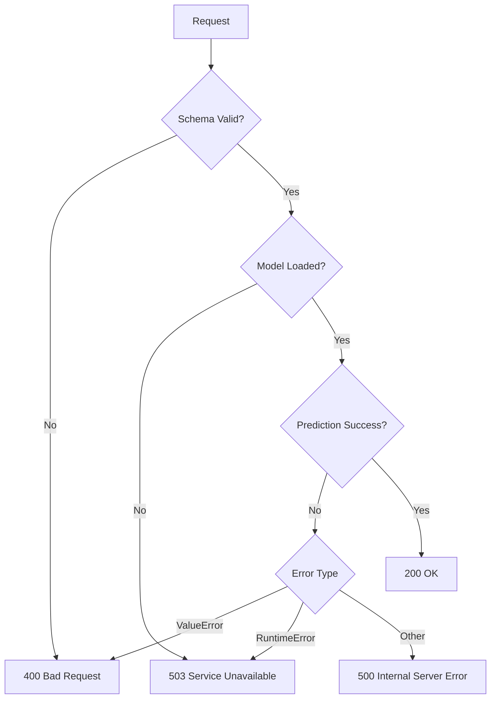

**Error Response Format:**

```python
{
    "detail": "Schema validation failed: Feature count mismatch",
    "request_id": "123e4567-e89b-12d3-a456-426614174000"
}
```

---

## 6. Model Serving

### 6.1 Model Loader

**File:** `src/api/services/model_loader.py`

Manages ONNX model lifecycle with hot-reload.

#### Hot-Reload Mechanism

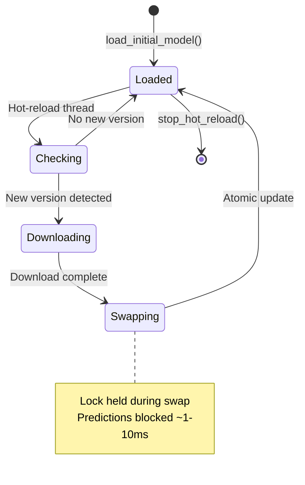

#### Class: `ModelLoader`

**Key Attributes:**

| Attribute | Type | Purpose |
|-----------|------|---------|
| `model` | `ort.InferenceSession` | ONNX Runtime session |
| `metadata` | `dict` | Schema, metrics, config |
| `baseline` | `dict` | Drift detection baseline |
| `current_version` | `str` | Active version |
| `model_lock` | `threading.Lock` | Thread-safe updates |
| `reload_thread` | `threading.Thread` | Background poller |

**Thread Safety:**

```python
# Prediction (read)
with self.model_lock:
    result = self.model.run(...)

# Reload (write)
with self.model_lock:
    self.model = new_model
    self.metadata = new_metadata
    self.baseline = new_baseline
```

**Lock Duration:**
- **Prediction:** 10-50ms
- **Reload:** 1-10ms

**Hot-Reload Interval:** 300 seconds (5 minutes)

### 6.2 Predictor

**File:** `src/api/services/predictor.py`

Inference service with schema validation.

#### Prediction Flow

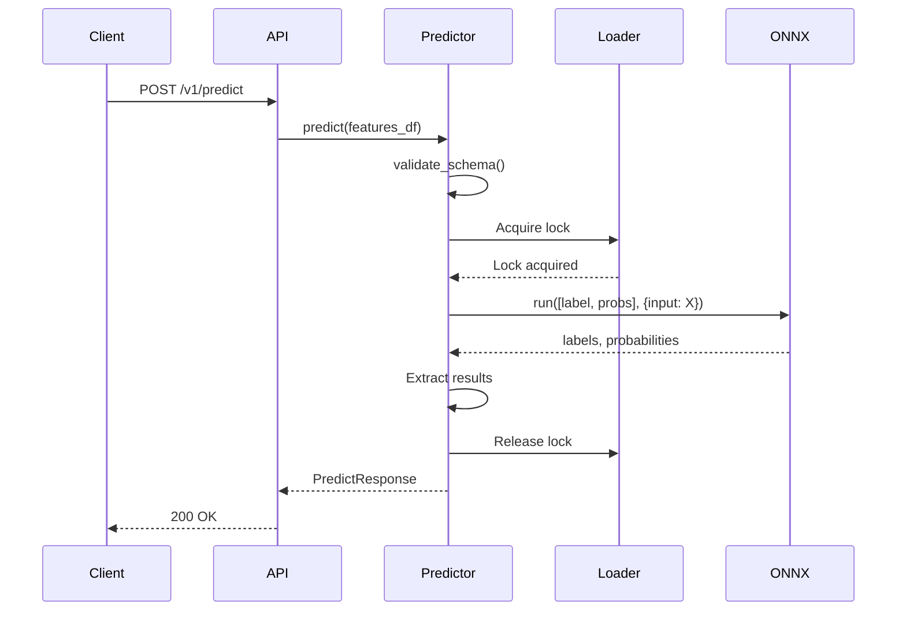

#### Class: `Predictor`

**Methods:**

```python
def predict(features: pd.DataFrame) -> dict[str, Any]
def predict_batch(features: pd.DataFrame) -> dict[str, Any]
```

**Schema Validation:**

```python
is_compatible, errors = SchemaGenerator.validate_schema_compatibility(
    features,
    metadata["schema"]
)

if not is_compatible:
    raise ValueError(f"Schema validation failed: {errors}")
```

**Performance:**

| Operation | Latency | Throughput |
|-----------|---------|------------|
| Single prediction | 10-50ms | 100-1000 RPS |
| Batch (100) | 50-200ms | ~0.5-2ms/instance |
| Batch (1000) | 200-500ms | ~0.2-0.5ms/instance |

---

## 7. Monitoring & Drift Detection

### 7.1 Architecture

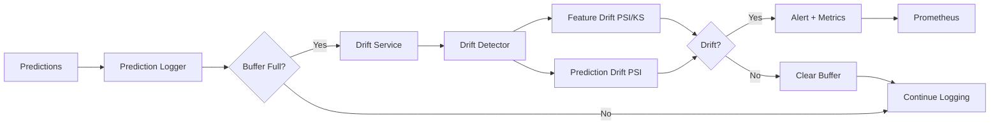

### 7.2 Prediction Logger

**File:** `src/monitoring/prediction_logger.py`

Thread-safe circular buffer for predictions.

#### Class: `PredictionLogger`

**Configuration:**

```python
def __init__(max_size: int = 1000)  # DRIFT_WINDOW_SIZE
```

**Buffer Structure:**

```python
{
    "features": {"age": 45, "income": 75000},
    "prediction": 1,
    "timestamp": datetime(2026, 1, 26, 12, 0, 0)
}
```

**Methods:**

| Method | Purpose |
|--------|---------|
| `log(features, prediction, timestamp)` | Add entry (thread-safe) |
| `get_snapshot()` | Copy buffer contents |
| `get_count()` | Current size |
| `clear()` | Empty buffer |
| `get_statistics()` | Buffer metrics |

### 7.3 Drift Detector

**File:** `src/monitoring/drift_detector.py`

Statistical drift detection engine.

#### Drift Detection Methods

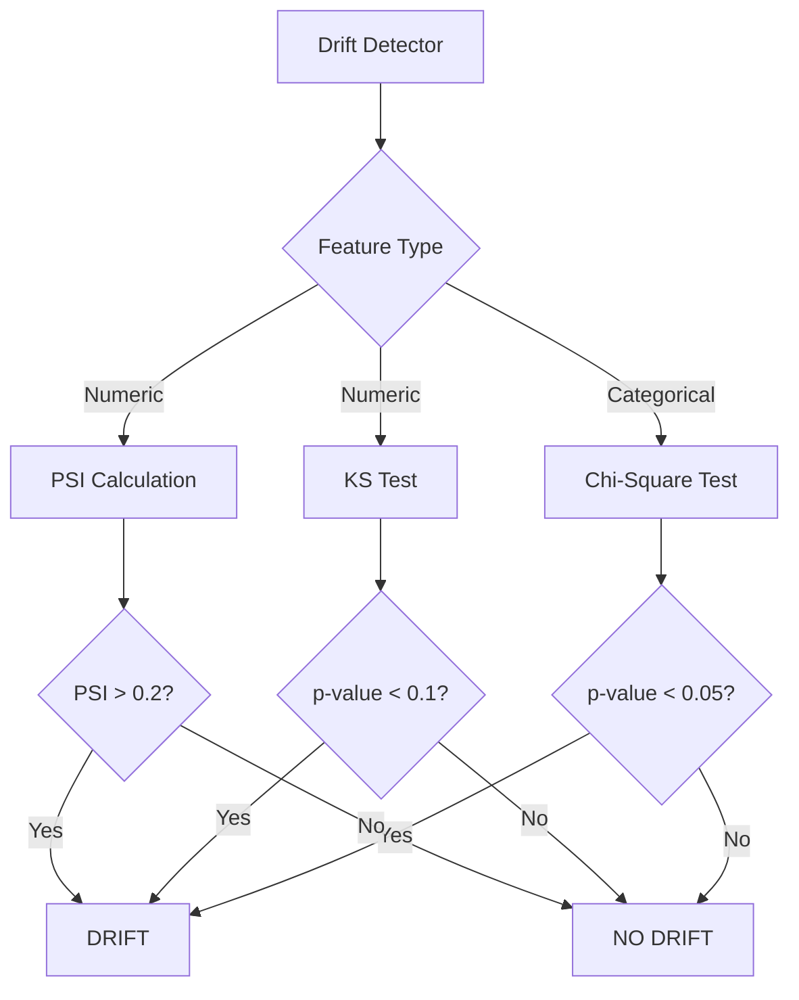

#### Statistical Tests

| Test | Feature Type | Metric | Threshold | Interpretation |
|------|--------------|--------|-----------|----------------|
| **PSI** | Numeric | Divergence | > 0.2 | Distribution shift |
| **KS** | Numeric | p-value | < 0.1 | Statistical difference |
| **Chi-Square** | Categorical | p-value | < 0.05 | Frequency change |

#### PSI Calculation

**Formula:**

```
PSI = Σ (current_pct[i] - baseline_pct[i]) × ln(current_pct[i] / baseline_pct[i])
```

**Binning:** Baseline percentiles (p25, p50, p75)

**Example:**

```python
detector = DriftDetector(baseline)

results = detector.detect_feature_drift(production_features)
# {
#     "drift_detected": True,
#     "drifted_features": ["age", "income"],
#     "feature_drift_scores": {
#         "age": {"drift_score": 0.25, "drift_detected": True, "method": "psi"},
#         "income": {"drift_score": 0.18, "drift_detected": False}
#     }
# }
```

### 7.4 Drift Service

**File:** `src/monitoring/drift_service.py`

Background monitoring service.

#### Monitoring Loop

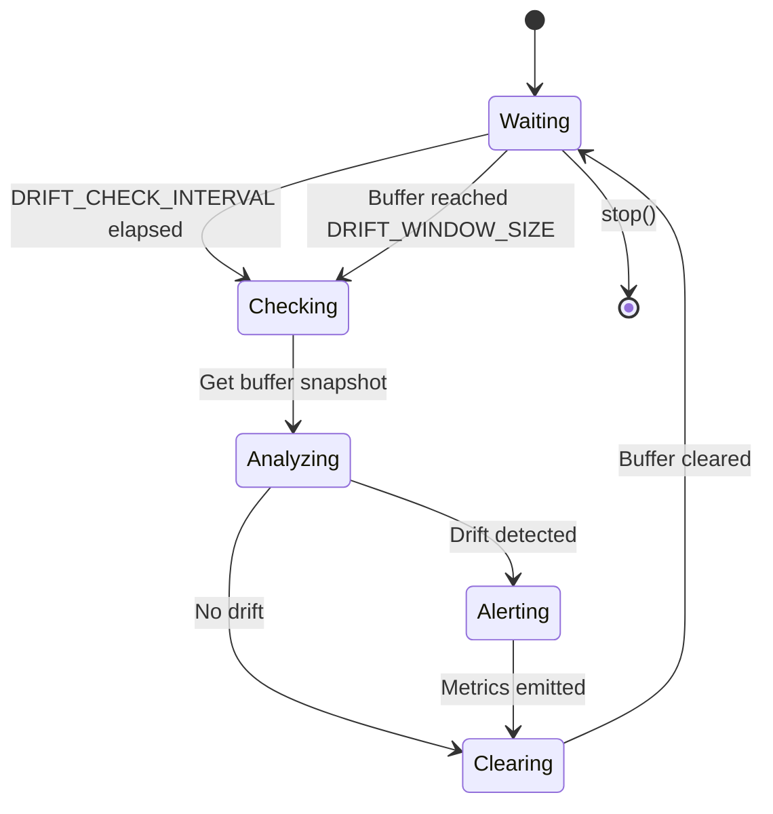

#### Class: `DriftService`

**Trigger Conditions:**

| Condition | Interval | Description |
|-----------|----------|-------------|
| **Time-based** | 3600s (1 hour) | Periodic check |
| **Buffer-based** | 1000 predictions | Immediate analysis |

**Workflow:**

```python
while not stop_event.is_set():
    # Wait for trigger
    stop_event.wait(DRIFT_CHECK_INTERVAL)
    
    # Check buffer size
    if prediction_logger.get_count() >= DRIFT_WINDOW_SIZE:
        # Run drift analysis
        results = _run_drift_check()
        _process_drift_results(results)
        
        # Clear buffer
        prediction_logger.clear()
```

### 7.5 Prometheus Metrics

**File:** `src/monitoring/metrics.py`

#### Metrics Catalog

| Metric | Type | Labels | Description |
|--------|------|--------|-------------|
| `prediction_requests_total` | Counter | endpoint, model_version | Total requests |
| `prediction_latency_seconds` | Histogram | endpoint, model_version | Latency distribution |
| `prediction_errors_total` | Counter | endpoint, error_type | Error count |
| `model_info` | Info | model_version, type, framework | Current model |
| `drift_score` | Gauge | feature_name, drift_type | Current drift score |
| `drift_alerts_total` | Counter | drift_type | Total drift alerts |
| `drift_check_duration_seconds` | Histogram | - | Drift analysis time |
| `prediction_buffer_size` | Gauge | - | Buffer utilization |
| `schema_validation_errors_total` | Counter | endpoint | Validation failures |

#### Example Queries

```promql
# Request rate (RPS)
rate(prediction_requests_total[5m])

# P95 latency
histogram_quantile(0.95, prediction_latency_seconds_bucket)

# Error rate
rate(prediction_errors_total[5m]) / rate(prediction_requests_total[5m])

# Drift alerts
increase(drift_alerts_total[1h])
```

#### Alerting Rules

```yaml
groups:
  - name: mlops_alerts
    rules:
      - alert: HighErrorRate
        expr: rate(prediction_errors_total[5m]) / rate(prediction_requests_total[5m]) > 0.05
        for: 5m
        
      - alert: HighLatency
        expr: histogram_quantile(0.95, prediction_latency_seconds_bucket) > 1.0
        for: 5m
        
      - alert: DriftDetected
        expr: increase(drift_alerts_total[1h]) > 0
        for: 0m
        
      - alert: ModelNotLoaded
        expr: absent(model_info)
        for: 1m
```

---

## 8. Deployment Guide

### 8.1 Kubernetes Configuration

#### Deployment Manifest

```yaml
apiVersion: apps/v1
kind: Deployment
metadata:
  name: mlops-api
spec:
  replicas: 3
  selector:
    matchLabels:
      app: mlops-api
  template:
    metadata:
      labels:
        app: mlops-api
    spec:
      serviceAccountName: mlops-service-account  # IAM role for S3
      containers:
      - name: api
        image: mlops-api:latest
        ports:
        - containerPort: 8000
        env:
        - name: ENVIRONMENT
          value: "production"
        - name: S3_BUCKET
          value: "mlops-production-models"
        - name: AWS_REGION
          value: "us-east-1"
        
        resources:
          requests:
            cpu: "1"
            memory: "2Gi"
          limits:
            cpu: "2"
            memory: "4Gi"
        
        livenessProbe:
          httpGet:
            path: /health
            port: 8000
          initialDelaySeconds: 10
          periodSeconds: 30
        
        readinessProbe:
          httpGet:
            path: /ready
            port: 8000
          initialDelaySeconds: 15
          periodSeconds: 10
          failureThreshold: 3
```

#### Service

```yaml
apiVersion: v1
kind: Service
metadata:
  name: mlops-api
spec:
  selector:
    app: mlops-api
  ports:
  - port: 80
    targetPort: 8000
  type: LoadBalancer
```

### 8.2 IAM Configuration

**S3 Access Policy:**

```json
{
  "Version": "2012-10-17",
  "Statement": [
    {
      "Effect": "Allow",
      "Action": [
        "s3:GetObject",
        "s3:PutObject",
        "s3:ListBucket",
        "s3:DeleteObject",
        "s3:HeadObject"
      ],
      "Resource": [
        "arn:aws:s3:::mlops-production-models/*",
        "arn:aws:s3:::mlops-production-models"
      ]
    }
  ]
}
```

### 8.3 Deployment Workflow

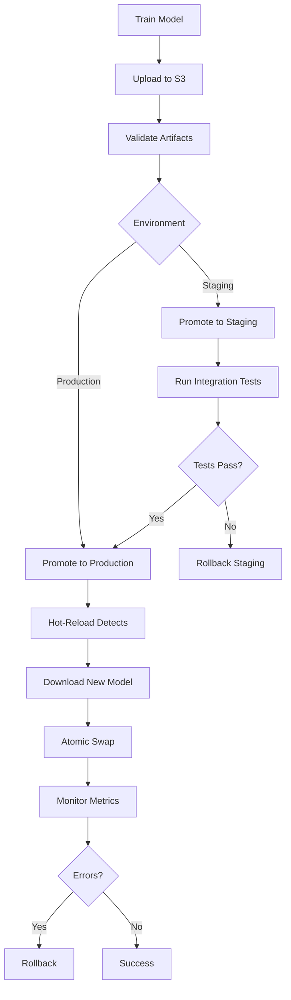

**Commands:**

```bash
# 1. Train model
python -m src.train.train --data data.csv --target churn

# 2. Promote to staging
python scripts/promote.py --version v20250126_120000_abc123 --env staging

# 3. Run tests
pytest tests/integration/ --env staging

# 4. Promote to production
python scripts/promote.py --version v20250126_120000_abc123 --env production

# 5. Monitor
kubectl logs -f deployment/mlops-api
curl http://api/metrics | grep drift_score
```

### 8.4 Monitoring Setup

**Prometheus Configuration:**

```yaml
scrape_configs:
  - job_name: 'mlops-api'
    kubernetes_sd_configs:
      - role: pod
    relabel_configs:
      - source_labels: [__meta_kubernetes_pod_label_app]
        action: keep
        regex: mlops-api
    metrics_path: '/metrics'
    scrape_interval: 15s
```

**Grafana Dashboards:**

| Panel | Query | Visualization |
|-------|-------|---------------|
| Request Rate | `rate(prediction_requests_total[5m])` | Graph |
| Latency P95 | `histogram_quantile(0.95, prediction_latency_seconds_bucket)` | Graph |
| Error Rate | `rate(prediction_errors_total[5m]) / rate(prediction_requests_total[5m])` | Graph |
| Drift Score | `drift_score` | Heatmap |
| Model Version | `model_info` | Stat |

---

## Appendix

### A. Version Format

**Pattern:** `v{YYYYMMDD}_{HHMMSS}_{hash6}`

**Regex:** `^v\d{8}_\d{6}_[a-f0-9]{6}$`

**Examples:**
- `v20250126_143022_abc123`
- `v20250201_090000_def456`

### B. HTTP Status Codes

| Code | Scenario | Response |
|------|----------|----------|
| 200 | Success | Prediction result |
| 400 | Invalid request | Schema validation error |
| 429 | Rate limit | "Rate limit exceeded" |
| 500 | Server error | "Internal server error" |
| 503 | Not ready | "Model not loaded" |

### C. Environment Variables

| Variable | Required | Default | Description |
|----------|----------|---------|-------------|
| `AWS_REGION` | No | us-east-1 | AWS region |
| `S3_BUCKET` | No | mlops-project-models | S3 bucket |
| `ENVIRONMENT` | No | production | Deployment env |
| `LOG_LEVEL` | No | INFO | Logging level |
| `ENABLE_DRIFT_DETECTION` | No | True | Enable drift |

### D. S3 Bucket Structure

```
mlops-production-models/
├── models/
│   ├── v20250126_120000_abc123.onnx
│   └── v20250125_100000_xyz789.onnx
├── metadata/
│   ├── v20250126_120000_abc123.json
│   └── v20250125_100000_xyz789.json
├── baselines/
│   ├── v20250126_120000_abc123_baseline.json
│   └── v20250125_100000_xyz789_baseline.json
└── serving/
    ├── production.json
    ├── staging.json
    └── history/
        ├── production_20250126_120000.json
        └── production_20250125_100000.json
```

---

**End of Technical Documentation**
